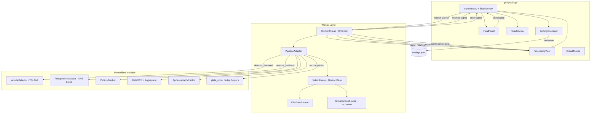
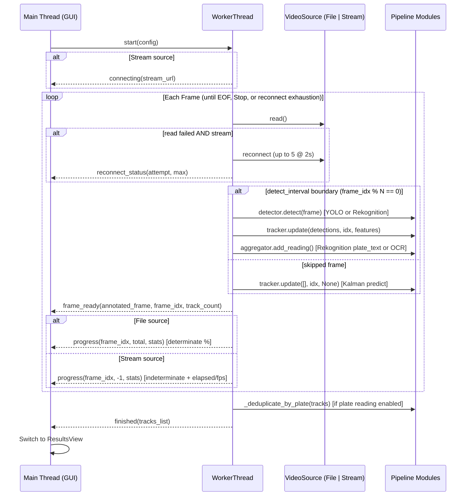
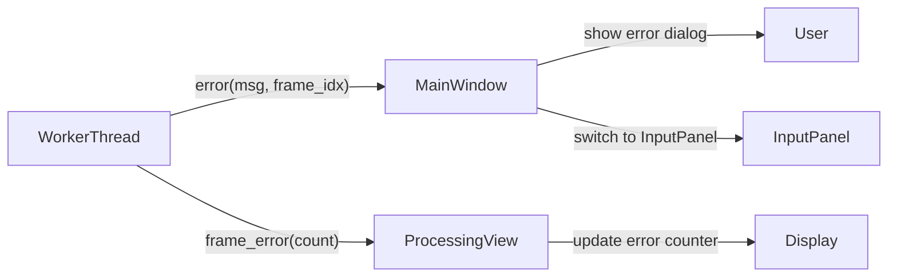

# Design Document: Opus LaneSight GUI

## Overview

The Opus LaneSight GUI is a PySide6 desktop application that wraps the existing Python vehicle detection pipeline (YOLOv8 + DeepSORT tracker + optional OCR) in a responsive graphical interface. The GUI provides video file selection, parameter configuration, live annotated processing preview, and tabular results display — all themed to the Opus brand identity.

The architecture follows a strict separation between the existing pipeline modules (which remain unmodified) and the GUI layer. A background `QThread` worker executes the pipeline frame-by-frame, emitting Qt signals that the UI consumes for live updates. Views are independent widget classes communicating exclusively through signals/slots, enabling future extensibility (RTSP input, zone editor, dashboards) without touching existing views.

**Key design decisions:**
1. **PySide6 over PyQt6** — LGPL license avoids commercial licensing requirements; API is identical.
2. **Single worker thread** — pipeline is I/O + GPU bound; one worker keeps complexity low while maintaining UI responsiveness.
3. **Adapter pattern for pipeline** — a thin `PipelineAdapter` class translates GUI parameters into pipeline constructor calls without modifying source modules.
4. **Abstract input source** — `VideoSource` protocol allows file-based input today, with a sibling `StreamVideoSource` for RTSP/RTMP/HTTP live streams (Requirement 11).
5. **Settings persistence via JSON** — simple, human-readable, no external dependencies.

**Extension design decisions (Requirements 11–15):**
6. **Live stream input** — `StreamVideoSource` mirrors the backend stream handling in `main.py` (`cv2.CAP_PROP_BUFFERSIZE=2`, default 25.0 FPS, `total_frames = -1`, up to 5 reconnect attempts at 2s intervals). The `WorkerThread` signals indeterminate progress and reconnection status so the `ProcessingView` never assumes a known frame total. The adapter replicates the backend loop frame-by-frame (it does **not** call `process_video` directly) so per-frame Qt signals can be emitted; the new parameters are threaded through that same loop.
7. **Selectable detector backend** — the `PipelineAdapter` constructs either `VehicleDetector` (local YOLOv8) or `RekognitionDetector` (AWS) based on `detector_backend`. Both expose the same `detect(frame)` contract returning dicts with `bbox`/`plate_bbox`/`vehicle_conf` and optionally `plate_text`/`plate_text_conf`, so the rest of the loop is backend-agnostic. `RekognitionDetector` uses `boto3` (a new dependency).
8. **Detection interval** — a validated `detect_interval` (1–60) runs detection every N frames; on skipped frames the adapter calls `tracker.update([], frame_idx, None)` so the Kalman filter predicts between detections, exactly as the backend does.
9. **Plate deduplication on completion** — the GUI reuses the backend reference algorithm by importing `plates_are_similar`, `normalize_plate`, and `pick_best_plate` from `plate_utils` (and replicates `_deduplicate_by_plate` semantics) rather than re-implementing fuzzy matching. Deduplication is applied only when plate text reading is enabled.
10. **No-output mode** — when enabled, the adapter skips `cv2.VideoWriter` creation entirely (`output_path = None`) and the `ResultsView` omits the output-path/open-folder affordances.
11. **Privacy posture preserved** — all plate-text reading (EasyOCR or Rekognition `DetectText`) remains opt-in and disabled by default, consistent with the Opus privacy-preserving positioning.

## Architecture

### High-Level System Diagram



### Threading Model



### Module Layout

```
gui/
├── __init__.py
├── main_window.py      # MainWindow, sidebar navigation, view switching
├── input_panel.py      # Video selection, parameter controls, start button
├── processing_view.py  # Live preview, progress bar, stats, cancel
├── results_view.py     # Vehicle table, summary cards, export
├── settings.py         # SettingsManager (load/save JSON)
├── worker.py           # WorkerThread (QThread), PipelineAdapter, FileVideoSource, StreamVideoSource
├── theme.py            # BrandTheme (stylesheet, colors, fonts)
└── resources/          # Opus logo PNG, app icon .ico
```

## Components and Interfaces

### 1. MainWindow (`main_window.py`)

Responsibilities: Application shell, sidebar navigation, view stack management, window title updates, close-during-processing confirmation, drag-and-drop handling.

```python
class MainWindow(QMainWindow):
    """Top-level application window with sidebar navigation and stacked views."""

    def __init__(self):
        # Sets up sidebar with nav entries: Input, Processing, Results
        # Initializes QStackedWidget for view switching
        # Applies BrandTheme stylesheet
        # Loads SettingsManager and restores window geometry
        ...

    def switch_view(self, view_name: str) -> None:
        """Switch the active view in the stack. Updates window title."""
        ...

    def start_processing(self, config: ProcessingConfig) -> None:
        """Create WorkerThread with config, connect signals, switch to ProcessingView."""
        ...

    def on_worker_finished(self, results: list[TrackResult]) -> None:
        """Handle pipeline completion — switch to ResultsView with results."""
        ...

    def on_worker_error(self, error_msg: str, frame_idx: int) -> None:
        """Handle pipeline error — show message, return to InputPanel."""
        ...

    def closeEvent(self, event: QCloseEvent) -> None:
        """Confirm exit during active processing."""
        ...

    def dragEnterEvent(self, event: QDragEnterEvent) -> None:
        """Accept video file drops with valid extensions."""
        ...

    def dropEvent(self, event: QDropEvent) -> None:
        """Validate dropped file and pass to InputPanel."""
        ...
```

### 2. InputPanel (`input_panel.py`)

Responsibilities: File selection dialog, video metadata display, parameter controls (confidence slider, OCR toggle, OCR settings, output path), start button state management.

```python
class InputPanel(QWidget):
    """Video input selection and processing parameter configuration."""

    # Signals
    start_requested = Signal(ProcessingConfig)

    def __init__(self, settings: SettingsManager):
        # Builds, in addition to file/confidence/OCR/output controls:
        #   - Input_Source_Mode selector (Req 11): "Video file" | "Live stream", default "Video file"
        #   - stream URL field (shown only in stream mode, max 2048 chars)
        #   - Detector_Backend selector (Req 12): "Local YOLOv8" | "AWS Rekognition"
        #   - AWS_Region field (shown only for Rekognition, 1-64 chars, default "us-east-1")
        #   - Detection_Interval spinbox (Req 13): 1-60, step 1, default 1
        #   - No_Output_Mode toggle (Req 15), restored from settings
        ...

    def select_video_file(self) -> None:
        """Open native file dialog filtered to MP4, AVI, MOV, MKV."""
        ...

    def validate_video(self, path: str) -> VideoMetadata | None:
        """Open with cv2.VideoCapture, read one frame, extract metadata."""
        ...

    def set_video_from_drop(self, path: str) -> None:
        """Accept a dropped file path — validates and updates UI."""
        ...

    def on_source_mode_changed(self, mode: str) -> None:
        """Req 11.2/11.3: show stream URL field and disable file controls in
        'Live stream' mode; restore file controls in 'Video file' mode."""
        ...

    def on_detector_backend_changed(self, backend: str) -> None:
        """Req 12.2/12.3: show AWS_Region field for Rekognition (default
        'us-east-1') and hide it for YOLOv8. Req 13.3: show the 5-10
        detect_interval recommendation when Rekognition is selected.
        Req 12.9: show the privacy note when Rekognition + plate reading."""
        ...

    def on_no_output_toggled(self, enabled: bool) -> None:
        """Req 15.2/15.3: disable the output path selector when enabled,
        enable it when disabled. Persists via settings (Req 15.6)."""
        ...

    def validate_before_start(self) -> str | None:
        """Pure validation invoked on 'Start processing'. Returns an inline
        error message or None when valid:
          - Req 11.5: stream mode + empty/whitespace URL -> error
          - Req 11.12: stream mode + URL without rtsp/rtmp/http/https -> error
          - Req 12.5: Rekognition + empty/whitespace AWS region -> error
        Retains field state and does not start when invalid."""
        ...

    def build_config(self) -> ProcessingConfig:
        """Collect all parameters (including source_mode/stream_url,
        detector_backend, aws_region, detect_interval, no_output) into a
        ProcessingConfig dataclass."""
        ...
```

### 3. ProcessingView (`processing_view.py`)

Responsibilities: Live frame display (QLabel with QPixmap), progress bar, statistics panel, cancel button. Consumes signals from WorkerThread only.

```python
class ProcessingView(QWidget):
    """Live processing display with annotated frame preview and progress."""

    # Signals
    cancel_requested = Signal()   # "Cancel" (file) and "Stop" (stream) both route here

    def __init__(self):
        # Progress widget supports two modes:
        #   - determinate QProgressBar (file input, Req 3.4)
        #   - indeterminate/busy QProgressBar with range (0, 0) (stream, Req 11.6)
        # Status line for connecting / reconnection messages (Req 11.8/11.13).
        # The Cancel button is labeled "Stop" in stream mode (Req 11.10).
        ...

    @Slot(QImage, int, int)
    def on_frame_ready(self, image: QImage, frame_idx: int, track_count: int) -> None:
        """Update the frame display with the latest annotated image."""
        ...

    @Slot(int, int, float, int, float)
    def on_progress(self, current: int, total: int, elapsed: float,
                    active_count: int, eta: float) -> None:
        """Update progress and statistics labels. When total == -1 (stream),
        switch the progress bar to indeterminate and show elapsed time,
        active vehicle count, and effective FPS instead of a percentage
        (Req 11.6/11.7)."""
        ...

    @Slot(str)
    def on_connecting(self, stream_url: str) -> None:
        """Req 11.13: before the first stream frame, show a connecting status
        message identifying the target stream URL."""
        ...

    @Slot(int, int)
    def on_reconnect_status(self, attempt: int, max_attempts: int) -> None:
        """Req 11.8: show 'Reconnecting (attempt/max)...' within 1s of each
        new attempt during a stream interruption."""
        ...

    @Slot(int)
    def on_frame_error(self, error_count: int) -> None:
        """Increment and display skipped frame counter."""
        ...
```

### 4. ResultsView (`results_view.py`)

Responsibilities: Vehicle results table (sortable), summary metric cards, output file link, new session button. Handles OCR column visibility.

```python
class ResultsView(QWidget):
    """Post-processing results display with table and summary statistics."""

    # Signals
    new_session_requested = Signal()

    def __init__(self):
        ...

    def display_results(self, results: list[TrackResult], fps: float,
                        ocr_enabled: bool, output_path: str | None,
                        skipped_frames: int, total_frames: int) -> None:
        """Populate table and compute summary statistics.
        When ocr_enabled (plate reading) is True, `results` are already the
        deduplicated rows (Req 14.1/14.5) produced by the WorkerThread, and the
        Plate Text / Confidence columns are shown. When False, every track is a
        separate row with those columns hidden (Req 14.4).
        When output_path is None (No_Output_Mode, Req 15.5), the output path
        label and open-folder button are hidden and replaced with the text
        'No output video written'."""
        ...

    def sort_by_column(self, column: int) -> None:
        """Toggle ascending/descending sort on clicked column header."""
        ...

    def open_output_folder(self) -> None:
        """Open containing folder in Windows Explorer via os.startfile.
        Hidden/disabled when No_Output_Mode is active (Req 15.5)."""
        ...
```

### 5. WorkerThread (`worker.py`)

Responsibilities: Execute pipeline in background thread, emit frame/progress/error/finished signals. Contains PipelineAdapter and VideoSource.

```python
class VideoSource(Protocol):
    """Abstract video input — file or live stream."""
    def open(self, source: str) -> bool: ...
    def read(self) -> tuple[bool, np.ndarray | None]: ...
    def get_metadata(self) -> VideoMetadata: ...
    def is_stream(self) -> bool: ...
    def release(self) -> None: ...

class FileVideoSource:
    """cv2.VideoCapture wrapper implementing VideoSource for local files.
    Reports a known total frame count for determinate progress."""
    ...

class StreamVideoSource:
    """cv2.VideoCapture wrapper for RTSP/RTMP/HTTP live streams (Req 11).

    Mirrors the backend stream handling in main.py:
      - cap.set(cv2.CAP_PROP_BUFFERSIZE, 2) to minimize latency
      - default FPS 25.0 when the stream does not report one
      - total_frames = -1 (unknown) -> indeterminate progress
      - reconnect(): on read failure, retries up to 5 times at 2s intervals,
        releasing and re-opening the capture; returns the current attempt
        number so the WorkerThread can emit reconnect_status. After 5 failed
        attempts it signals exhaustion (Req 11.9).
    is_stream() returns True so the WorkerThread selects indeterminate-progress
    and reconnection behavior."""

    MAX_RECONNECT = 5
    RECONNECT_INTERVAL_SECONDS = 2

    def reconnect(self) -> int:
        """Attempt one reconnection; return the attempt count (1..5) or raise
        StreamLostError after MAX_RECONNECT failures."""
        ...

@dataclass
class ProcessingConfig:
    # Input source (Req 11)
    source_mode: str            # "file" | "stream"
    video_path: str             # populated in file mode, "" in stream mode
    stream_url: str             # populated in stream mode, "" in file mode
    output_path: str | None     # None when No_Output_Mode is enabled (Req 15)
    confidence: float
    ocr_enabled: bool
    ocr_languages: list[str]
    ocr_interval: int
    plate_model_path: str | None
    # Detector backend (Req 12) and interval (Req 13)
    detector_backend: str       # "yolo" | "rekognition"
    aws_region: str             # used when detector_backend == "rekognition"
    detect_interval: int        # 1-60
    no_output: bool             # mirrors output_path is None (Req 15)

class WorkerThread(QThread):
    """Background pipeline execution thread."""

    # Signals
    frame_ready = Signal(QImage, int, int)       # annotated frame, frame_idx, active_tracks
    progress = Signal(int, int, float, int, float)  # current, total(-1 if stream), elapsed, active, eta
    connecting = Signal(str)                      # stream_url, before first frame (Req 11.13)
    reconnect_status = Signal(int, int)           # attempt, max_attempts (Req 11.8)
    frame_error = Signal(int)                     # cumulative error count
    finished = Signal(list)                       # list[TrackResult] (deduplicated if plate reading on)
    error = Signal(str, int)                      # error message, frame_idx
    log_output = Signal(str)                      # captured stdout/stderr line

    def __init__(self, config: ProcessingConfig):
        ...

    def run(self) -> None:
        """Main processing loop — select VideoSource (file/stream), detect on
        detect_interval boundaries (Kalman predict on skipped frames), track,
        feed plate text into the aggregator, emit per-frame signals.
        - Stream: emit `connecting` before the first frame, emit indeterminate
          progress, handle reconnection via StreamVideoSource (emitting
          reconnect_status), and on exhaustion finish with collected tracks
          (Req 11.9). Skip VideoWriter unless an output path is provided
          (Req 11.11).
        - No_Output_Mode: skip VideoWriter creation entirely (Req 15.4).
        - On completion, apply _deduplicate_by_plate semantics when plate
          reading is enabled before emitting `finished` (Req 14)."""
        ...

    def request_cancel(self) -> None:
        """Set cancellation flag (thread-safe via threading.Event). Serves both
        the file 'Cancel' and stream 'Stop' controls; stops within 3s, releases
        the source, and lets run() finish with the tracks collected so far
        (Req 3.6, Req 11.10)."""
        ...
```

### 6. SettingsManager (`settings.py`)

Responsibilities: Load/save JSON at `%LOCALAPPDATA%\OpusLaneSight\settings.json`, validate ranges, provide defaults, handle missing/corrupt files gracefully.

```python
@dataclass
class AppSettings:
    confidence: float = 0.5
    ocr_enabled: bool = False
    ocr_language: str = "en"
    ocr_interval: int = 10
    output_path: str = ""
    window_width: int = 1280
    window_height: int = 800
    window_x: int | None = None
    window_y: int | None = None
    # Extension persisted prefs (Req 12, 13, 15, 11)
    detector_backend: str = "yolo"   # "yolo" | "rekognition"
    aws_region: str = "us-east-1"    # 1-64 chars
    detect_interval: int = 1         # 1-60
    no_output: bool = False
    source_mode: str = "file"        # "file" | "stream"

class SettingsManager:
    """Manages application settings persistence."""

    CONFIG_DIR = Path(os.environ.get("LOCALAPPDATA", "")) / "OpusLaneSight"
    CONFIG_FILE = CONFIG_DIR / "settings.json"

    def __init__(self):
        self._settings = self._load()

    def get(self) -> AppSettings: ...
    def update(self, **kwargs) -> None: ...
    def save(self) -> None: ...
    def _load(self) -> AppSettings: ...
    def _validate(self, data: dict) -> AppSettings: ...
```

### 7. BrandTheme (`theme.py`)

Responsibilities: Generate Qt stylesheet string, define color constants, font setup, card styling helpers.

```python
class BrandTheme:
    """Opus brand theme constants and stylesheet generator."""

    # Colors
    TEAL_DARK = "#004851"
    TEAL = "#00968F"
    GREEN = "#93D500"
    BLUE = "#00A0E0"
    ORANGE = "#FF8200"
    CHARCOAL = "#131E29"
    GRAY = "#54565A"
    BG = "#F4F7F7"
    WHITE = "#FFFFFF"
    CARD_BORDER = "rgba(19, 30, 41, 0.08)"

    # Gradient
    HEADER_GRADIENT = "qlineargradient(x1:0, y1:0, x2:1, y2:1, stop:0 #004851, stop:0.58 #00968F, stop:1 #93D500)"

    @staticmethod
    def get_stylesheet() -> str:
        """Return the full application QSS stylesheet."""
        ...

    @staticmethod
    def apply(app: QApplication) -> None:
        """Apply theme: set font, palette, stylesheet."""
        ...
```

### 8. PipelineAdapter (within `worker.py`)

Thin adapter that bridges GUI config to pipeline module constructors without modifying them.

```python
class PipelineAdapter:
    """Adapts GUI ProcessingConfig to pipeline module initialization.
    Replicates the main.py process_video loop frame-by-frame so the GUI can
    emit per-frame Qt signals, without importing or modifying process_video."""

    def __init__(self, config: ProcessingConfig):
        # Req 12: select detector backend. Both expose detect(frame) -> list[dict]
        # with bbox/plate_bbox/vehicle_conf and optionally plate_text/plate_text_conf.
        if config.detector_backend == "rekognition":
            self.detector = RekognitionDetector(
                region_name=config.aws_region,
                confidence=config.confidence,
                use_rekognition_text=config.ocr_enabled,  # plate text only when opted-in (Req 12.8)
            )
        else:
            self.detector = VehicleDetector(
                vehicle_model_path="yolov8n.pt",
                plate_model_path=config.plate_model_path,
                confidence=config.confidence,
            )
        self.tracker = VehicleTracker(
            iou_threshold=0.3,
            max_lost=60,
            min_hits=3,
            appearance_weight=0.4,
            reid_threshold=0.45,
            gallery_max_age=300,
        )
        self.appearance = AppearanceExtractor(feature_dim=128)
        self.ocr = None
        self.aggregator = None
        if config.ocr_enabled:
            self.ocr = PlateOCR(languages=config.ocr_languages, gpu=True)
            self.aggregator = PlateTextAggregator(min_readings=3, agreement_threshold=0.4)
        elif config.detector_backend == "rekognition":
            # Rekognition reads text for free; aggregate it when plate reading is on.
            self.aggregator = PlateTextAggregator(min_readings=2, agreement_threshold=0.4)
        self.detect_interval = config.detect_interval

    def process_frame(self, frame: np.ndarray, frame_idx: int) -> tuple[np.ndarray, list, int]:
        """Process a single frame through the full pipeline.
        Req 13: run detector.detect() only when frame_idx % detect_interval == 0;
        on skipped frames call tracker.update([], frame_idx, None) so the Kalman
        filter predicts between detections. When the Rekognition backend returns
        plate_text, feed it into the aggregator (Req 12, mirrors main.py).
        Returns: (annotated_frame, active_tracks, active_count)"""
        ...

    def finalize(self, tracks: list) -> list:
        """Req 14: after processing, apply consensus plate text then merge
        tracks via plate_utils (plates_are_similar / normalize_plate /
        pick_best_plate), replicating main._deduplicate_by_plate: tracks with
        plate text >= 3 chars are grouped by fuzzy similarity; the merged row
        uses min(first_frame)/max(last_frame), summed hit_count, and the best
        plate; tracks without plate text or < 3 chars stay as separate rows.
        Applied only when plate reading is enabled; otherwise returns tracks
        unchanged (Req 14.3/14.4)."""
        ...
```

## Data Models

### ProcessingConfig

```python
@dataclass
class ProcessingConfig:
    """Immutable configuration for a processing session."""
    source_mode: str           # "file" | "stream" (Req 11)
    video_path: str            # set in file mode; "" in stream mode
    stream_url: str            # set in stream mode; "" in file mode (Req 11)
    output_path: str | None    # None when No_Output_Mode enabled (Req 15)
    confidence: float          # 0.1 – 1.0
    ocr_enabled: bool          # plate text reading opt-in (Req 12.8)
    ocr_languages: list[str]   # e.g. ["en"]
    ocr_interval: int          # 1 – 100
    plate_model_path: str | None
    detector_backend: str      # "yolo" | "rekognition" (Req 12)
    aws_region: str            # 1 – 64 chars, default "us-east-1" (Req 12)
    detect_interval: int       # 1 – 60, passed as detect_interval (Req 13)
    no_output: bool            # mirrors output_path is None (Req 15)
```

### VideoMetadata

```python
@dataclass
class VideoMetadata:
    """Metadata extracted from a video file on selection."""
    file_name: str
    file_path: str
    width: int
    height: int
    frame_count: int
    fps: float
    duration_seconds: float    # frame_count / fps
```

### TrackResult

```python
@dataclass
class TrackResult:
    """Per-vehicle result computed from TrackedVehicle after processing."""
    vehicle_id: int
    plate_text: str            # empty if OCR disabled or no reading
    plate_confidence: float    # 0.0 if no reading
    first_frame: int
    last_frame: int
    enter_time: float          # first_frame / fps (seconds)
    leave_time: float | None   # last_frame / fps or None if still in frame
    wait_time: float | None    # leave_time - enter_time or None
```

### AppSettings

```python
@dataclass
class AppSettings:
    """Persisted application settings."""
    confidence: float = 0.5
    ocr_enabled: bool = False
    ocr_language: str = "en"
    ocr_interval: int = 10
    output_path: str = ""
    window_width: int = 1280
    window_height: int = 800
    window_x: int | None = None
    window_y: int | None = None
    detector_backend: str = "yolo"   # "yolo" | "rekognition" (Req 12)
    aws_region: str = "us-east-1"    # 1 – 64 chars (Req 12)
    detect_interval: int = 1         # 1 – 60 (Req 13)
    no_output: bool = False          # No_Output_Mode (Req 15)
    source_mode: str = "file"        # "file" | "stream" (Req 11)
```

### Settings JSON Schema

```json
{
  "confidence": 0.5,
  "ocr_enabled": false,
  "ocr_language": "en",
  "ocr_interval": 10,
  "output_path": "",
  "window_width": 1280,
  "window_height": 800,
  "window_x": null,
  "window_y": null,
  "detector_backend": "yolo",
  "aws_region": "us-east-1",
  "detect_interval": 1,
  "no_output": false,
  "source_mode": "file"
}
```

Stored at: `%LOCALAPPDATA%\OpusLaneSight\settings.json`

Validation on load (Req 5.3 extended): `detector_backend` must be one of
`{"yolo", "rekognition"}` (else `"yolo"`); `aws_region` must be a 1–64 char
non-empty string (else `"us-east-1"`); `detect_interval` is clamped to 1–60
and non-integers fall back to 1; `no_output` must be boolean (else `false`);
`source_mode` must be one of `{"file", "stream"}` (else `"file"`).


## Correctness Properties

*A property is a characteristic or behavior that should hold true across all valid executions of a system — essentially, a formal statement about what the system should do. Properties serve as the bridge between human-readable specifications and machine-verifiable correctness guarantees.*

### Property 1: Default output path derivation

*For any* valid input video file path (with a parent directory and file name), the default output path SHALL be `"output.mp4"` located in the same directory as the input file.

**Validates: Requirements 2.7**

### Property 2: Progress percentage invariant

*For any* frame index `current` and total frame count `total` where `0 <= current <= total` and `total > 0`, the computed progress percentage SHALL equal `(current / total) * 100`, always within the range [0, 100].

**Validates: Requirements 3.4**

### Property 3: TrackResult time computation

*For any* TrackedVehicle with `first_frame >= 0`, `last_frame >= first_frame`, and `fps > 0`, the computed `enter_time` SHALL equal `first_frame / fps`, `leave_time` SHALL equal `last_frame / fps`, and `wait_time` SHALL equal `leave_time - enter_time` (non-negative).

**Validates: Requirements 4.1**

### Property 4: Summary statistics correctness with incomplete track exclusion

*For any* list of TrackResult objects, the summary statistics (average, maximum, minimum wait time) SHALL be computed exclusively from tracks that have both `enter_time` and `leave_time` (i.e., `leave_time is not None`). Tracks with `leave_time = None` SHALL be excluded from all aggregate computations. The computed average SHALL equal `sum(wait_times) / len(wait_times)`, max SHALL equal `max(wait_times)`, and min SHALL equal `min(wait_times)` for the filtered subset.

**Validates: Requirements 4.2, 4.8**

### Property 5: Default sort order

*For any* list of TrackResult objects, the default display order SHALL be ascending by `enter_time` such that for all consecutive pairs `(results[i], results[i+1])`, `results[i].enter_time <= results[i+1].enter_time`.

**Validates: Requirements 4.3**

### Property 6: Settings round-trip persistence

*For any* valid `AppSettings` instance (confidence in [0.1, 1.0], ocr_interval in [1, 100], ocr_language is a non-empty string), serializing to JSON and then deserializing SHALL produce an `AppSettings` instance with identical field values.

**Validates: Requirements 5.2**

### Property 7: Invalid settings produce valid defaults

*For any* string that is not valid JSON, or a JSON object with field values outside valid ranges, the SettingsManager SHALL return an `AppSettings` instance where all fields are within their valid ranges (confidence in [0.1, 1.0], ocr_interval in [1, 100], ocr_enabled is boolean).

**Validates: Requirements 5.3**

### Property 8: Confidence threshold clamping

*For any* floating-point value `v`, clamping to the valid confidence range SHALL produce `max(0.1, min(1.0, v))`, which is always within [0.1, 1.0].

**Validates: Requirements 8.5**

### Property 9: Frame error counter accuracy

*For any* sequence of frame-read outcomes (success or failure), the cumulative error counter SHALL equal the total number of failures in the sequence.

**Validates: Requirements 8.3**

### Property 10: File extension validation

*For any* file path string, the drag-and-drop extension validator SHALL accept the path if and only if its extension (case-insensitive) is one of `.mp4`, `.avi`, `.mov`, or `.mkv`.

**Validates: Requirements 9.6**

### Property 11: Stream URL scheme validation

*For any* string `url`, the stream URL validator SHALL accept it if and only if (after trimming surrounding whitespace) it is non-empty and begins, case-insensitively, with one of the schemes `rtsp://`, `rtmp://`, `http://`, or `https://`, and its length does not exceed 2048 characters. Whitespace-only and unsupported-scheme strings SHALL be rejected.

**Validates: Requirements 11.2, 11.5, 11.12**

### Property 12: ProcessingConfig source/parameter mapping

*For any* valid InputPanel control state, `build_config()` SHALL map the selections faithfully: in `"stream"` mode `stream_url` equals the entered URL and `video_path` equals `""`; in `"file"` mode `video_path` is the selected path and `stream_url` equals `""`; the detector selection maps to exactly `"yolo"` or `"rekognition"`; `aws_region` is carried through unchanged; and `detect_interval` is passed as an integer within `[1, 60]`.

**Validates: Requirements 11.4, 12.4, 13.2**

### Property 13: Stream reconnection attempt counting

*For any* number of consecutive stream-read failures `k`, the reconnection counter SHALL report `min(k, 5)` as the current attempt number, and exhaustion (stream lost) SHALL be signaled if and only if `k > 5`, at which point processing finishes with the tracks collected before the interruption.

**Validates: Requirements 11.8, 11.9**

### Property 14: AWS region validation

*For any* string `region`, the AWS region validator SHALL accept it if and only if, after trimming surrounding whitespace, it is non-empty and its length is within `[1, 64]`. Empty and whitespace-only strings SHALL be rejected.

**Validates: Requirements 12.5**

### Property 15: Detection interval clamping

*For any* numeric value `v`, clamping to the valid detection-interval range SHALL produce `max(1, min(60, round(v)))`, which is always an integer within `[1, 60]` (equal to 1 when `v < 1` and 60 when `v > 60`).

**Validates: Requirements 13.4, 13.5**

### Property 16: Detection interval non-integer rejection

*For any* manual text entry, the detection-interval parser SHALL reject values that do not denote an integer and SHALL preserve the most recent valid integer value; it SHALL accept a value if and only if the entry denotes an integer, which is then clamped to `[1, 60]`.

**Validates: Requirements 13.6**

### Property 17: Plate deduplication merge invariants

*For any* list of tracks with plate text reading enabled, the deduplication SHALL place two tracks in the same merged row if and only if their plate texts are equal or are matched after OCR-confusable normalization (O/0, I/1, S/5, B/8); each merged row's `first_frame` SHALL equal the minimum `first_frame` of its group, its `last_frame` SHALL equal the maximum `last_frame`, its `hit_count` SHALL equal the sum of the group's hit counts, and its plate text SHALL equal the best plate selected by `pick_best_plate`. Tracks whose plate text is absent or shorter than 3 characters SHALL each remain a separate, unmerged row.

**Validates: Requirements 14.1, 14.2, 14.3**

### Property 18: Deduplication identity-when-disabled and idempotence

*For any* list of tracks, when plate text reading is disabled the deduplication SHALL return rows equal in count and content to the input tracks (no merging); and when enabled the deduplication SHALL be idempotent such that applying it twice yields the same result as applying it once (`dedup(dedup(tracks)) == dedup(tracks)`). Summary statistics SHALL be computed from the deduplicated row set.

**Validates: Requirements 14.4, 14.5**

### Property 19: No-output mode config mapping

*For any* InputPanel control state, when No_Output_Mode is enabled `build_config().output_path` SHALL be `None` (and `no_output` is `True`); when disabled `output_path` SHALL be a non-`None` path string.

**Validates: Requirements 15.4**

### Property 20: Extended settings round-trip persistence

*For any* valid `AppSettings` instance (including `detector_backend` in `{"yolo","rekognition"}`, `aws_region` a 1–64 char string, `detect_interval` in `[1, 60]`, `no_output` boolean, and `source_mode` in `{"file","stream"}`), serializing to JSON and deserializing SHALL produce an `AppSettings` instance with identical field values; and invalid/out-of-range values for these new fields SHALL fall back to their documented defaults.

**Validates: Requirements 5.3, 12.2, 15.1, 15.6**

## Error Handling

### Error Categories and Strategies

| Category | Trigger | Strategy | User Feedback |
|---|---|---|---|
| **Startup failure** | Missing PySide6, import error | Catch `ImportError` in `__main__`, show `QMessageBox.critical` | Error dialog with dependency name, then `sys.exit(1)` |
| **Model missing** | `yolov8n.pt` not found | Check before starting worker | Error dialog suggesting file placement |
| **Invalid video file** | OpenCV cannot open or read frame | `cv2.VideoCapture.isOpened()` + `read()` check | Inline error on InputPanel |
| **Output path not writable** | Permission denied or missing dir | `os.access()` check before start | Inline error, re-enable path selector |
| **Frame-read failure** | `cap.read()` returns `(False, None)` | Skip frame, increment counter | Error count in ProcessingView stats |
| **Consecutive frame failures (>100)** | Corrupt video mid-stream | Abort processing | Error message with frame number, return to InputPanel |
| **Pipeline exception** | Unhandled exception in detection/tracking/OCR | `try/except` in WorkerThread `run()` | Error signal → dialog with exception type + frame number |
| **Settings file corrupt** | Invalid JSON or out-of-range values | Fallback to defaults, overwrite file | Silent recovery (no user disruption) |
| **Settings file not writable** | Permissions issue | In-memory operation | Non-blocking warning toast |
| **Worker cancellation** | User clicks Cancel or closes window | `threading.Event` flag checked per frame | Cancellation message, return to InputPanel |
| **Stream connect failure** | Stream URL cannot be opened at all | `StreamVideoSource.open()` returns False | Error message, return to InputPanel |
| **Stream reconnection exhaustion** | Stream lost, >5 reconnect attempts at 2s | `StreamVideoSource.reconnect()` raises `StreamLostError` | "Stream lost" message; switch to ResultsView with tracks collected so far (Req 11.9) |
| **AWS credentials error** | Missing/invalid AWS credentials on Rekognition call | Catch boto3 `NoCredentialsError`/`ClientError` (`UnrecognizedClient`, `InvalidSignature`) in WorkerThread | Error dialog identifying an AWS credentials error; retain selections; return to InputPanel (Req 12.6) |
| **AWS region/service/network error** | Region, throttling, or service exception from Rekognition | Catch boto3 `ClientError`/`EndpointConnectionError`/`BotoCoreError` | Error dialog describing the AWS API failure; retain selections; return to InputPanel (Req 12.7) |

### Error Signal Flow



### Stdout/Stderr Capture

The WorkerThread redirects `sys.stdout` and `sys.stderr` to a `QueueIO` object during processing. Captured lines are emitted via `log_output` signal to a collapsible log panel. The buffer retains at most 10,000 lines (oldest discarded via `collections.deque`).

```python
class QueueIO(io.TextIOBase):
    """Thread-safe IO wrapper that emits lines via a callback."""
    def __init__(self, callback: Callable[[str], None]):
        self._callback = callback
        self._buffer = ""

    def write(self, text: str) -> int:
        self._buffer += text
        while "\n" in self._buffer:
            line, self._buffer = self._buffer.split("\n", 1)
            self._callback(line)
        return len(text)
```

### Graceful Degradation

- If the Roboto font is not installed, fall back to system sans-serif (`Arial`, `Segoe UI`).
- If the Opus logo PNG is missing from resources, display text "OPUS" in brand font/color.
- If GPU is unavailable for OCR, fall back to CPU mode silently (EasyOCR handles this internally).

## Testing Strategy

### Dual Testing Approach

The testing strategy combines:
1. **Property-based tests** — verify universal invariants across generated inputs for pure logic functions
2. **Unit tests** — verify specific examples, edge cases, and UI widget behavior
3. **Integration tests** — verify end-to-end flows with mocked pipeline

### Property-Based Testing Configuration

**Library:** [Hypothesis](https://hypothesis.readthedocs.io/) (Python PBT library, well-maintained, MIT license)

**Configuration:**
- Minimum 100 examples per property test (`@settings(max_examples=100)`)
- Each test tagged with design property reference
- Tag format: `# Feature: lanesight-gui, Property {N}: {title}`

**Test file:** `tests/test_gui_properties.py`

### Property Test Targets

| Property | Function Under Test | Generator Strategy |
|---|---|---|
| 1: Default output path | `derive_default_output_path(input_path)` | `st.from_regex(r'[A-Za-z]:\\[\\w\\\\]+\\.mp4')` |
| 2: Progress percentage | `compute_progress(current, total)` | `st.integers(0, 10000)` for both |
| 3: TrackResult computation | `build_track_result(vehicle, fps)` | `st.builds(TrackedVehicle, ...)` |
| 4: Summary statistics | `compute_summary(results)` | `st.lists(st.builds(TrackResult, ...))` |
| 5: Default sort | `sort_results_default(results)` | `st.lists(st.builds(TrackResult, ...))` |
| 6: Settings round-trip | `SettingsManager.save()` → `load()` | `st.builds(AppSettings, ...)` |
| 7: Invalid settings defaults | `SettingsManager._load(raw_json)` | `st.text()` + `st.dictionaries(...)` |
| 8: Confidence clamping | `clamp_confidence(value)` | `st.floats(-100, 100)` |
| 9: Frame error counter | `count_errors(outcomes)` | `st.lists(st.booleans())` |
| 10: Extension validation | `is_valid_video_extension(path)` | `st.text()` + known extensions |
| 11: Stream URL scheme validation | `is_valid_stream_url(url)` | `st.text()` + `st.sampled_from(schemes)` prefixes |
| 12: Config source/param mapping | `InputPanel.build_config()` | `st.builds(control_state, ...)` (modes, backends, regions, intervals) |
| 13: Reconnection attempt counting | `StreamVideoSource.reconnect()` state | `st.integers(0, 12)` failure runs (cap mocked capture) |
| 14: AWS region validation | `is_valid_aws_region(region)` | `st.text()` incl. whitespace + 0–80 char lengths |
| 15: Detect interval clamping | `clamp_detect_interval(v)` | `st.floats(-100, 200)` / `st.integers(-100, 200)` |
| 16: Detect interval non-integer rejection | `parse_detect_interval(text, last)` | `st.text()` + `st.integers()` |
| 17: Dedup merge invariants | `deduplicate_by_plate(tracks)` (uses `plate_utils`) | `st.lists(st.builds(TrackResult, plate_text=...))` |
| 18: Dedup identity/idempotence | `deduplicate_by_plate(tracks, enabled)` | `st.lists(st.builds(TrackResult, ...))` |
| 19: No-output config mapping | `InputPanel.build_config()` | `st.builds(control_state, no_output=st.booleans())` |
| 20: Extended settings round-trip | `SettingsManager.save()` → `load()` | `st.builds(AppSettings, ...)` incl. new fields |

### Unit Test Targets

| Component | Test Focus |
|---|---|
| `InputPanel` | Widget state (button enabled/disabled), OCR controls visibility, source-mode selector default + stream URL field visibility, file controls disabled in stream mode, detector-backend default + AWS region field visibility, detect-interval bounds/default, Rekognition 5–10 recommendation visible, no-output toggle disabling the output path selector, privacy note under Rekognition + plate reading |
| `ProcessingView` | Progress bar value updates (determinate), indeterminate progress when `total == -1`, connecting status text shows URL, reconnection status text, Stop button label in stream mode, stats label formatting |
| `ResultsView` | Table column count, column visibility with OCR on/off, empty state, output path/open-folder omitted with "no output video written" text when `output_path is None` |
| `SettingsManager` | Directory creation, default values (incl. new fields), file corruption recovery, new-field range fallbacks |
| `BrandTheme` | Stylesheet contains expected color hex values |
| `MainWindow` | View switching, window title format, drag-and-drop acceptance |

### Integration Test Targets

| Flow | Approach |
|---|---|
| Full processing session | Mock `VehicleDetector` to return canned detections, verify signals emitted |
| Cancellation flow | Start worker, cancel after N frames, verify thread stops |
| Error propagation | Inject exception in mocked detector, verify error signal reaches UI |
| Settings persistence | Write settings, relaunch manager, verify values match |
| Stream processing + reconnection | Fake `StreamVideoSource` that yields N frames then fails; verify indeterminate progress, reconnect_status emissions, and finish-with-collected-tracks on exhaustion (Req 11.7–11.9) |
| Stream Stop control | Start stream worker, request stop, verify stop within 3s and switch to ResultsView (Req 11.10) |
| Rekognition backend selection | Mock `RekognitionDetector` (patch `boto3.client`) returning canned detections; verify the adapter selects it for `detector_backend="rekognition"` and threads plate_text into the aggregator |
| AWS error handling | Mock `boto3` Rekognition client to raise `NoCredentialsError` and a service `ClientError`; verify credentials vs service error classification and return to InputPanel (Req 12.6/12.7) |
| Recording for stream | Provide an output path in stream mode; verify `cv2.VideoWriter` is created (mocked) (Req 11.11) |

**Rekognition / boto3 mocking:** Rekognition integration tests MUST NOT call AWS. Patch `boto3.client("rekognition")` (e.g., via `unittest.mock` or `botocore.stub.Stubber`) so `RekognitionDetector.detect()` returns canned label/text responses and errors are injected deterministically. This keeps tests offline, fast, and credential-free.

### Test Execution

```bash
# Run all tests
pytest tests/ -v

# Run property tests only
pytest tests/test_gui_properties.py -v

# Run with Hypothesis verbose output
pytest tests/test_gui_properties.py --hypothesis-show-statistics
```

### Coverage Goals

- Property tests cover all 20 correctness properties
- Unit tests cover widget construction and state transitions
- Integration tests cover the worker→signal→view pipeline, stream reconnection, and the Rekognition backend (boto3 mocked)
- No tests require a running display server (use `QApplication` with `offscreen` platform plugin via `QT_QPA_PLATFORM=offscreen`)

## Dependencies

The GUI introduces no new dependency for itself beyond PySide6; however, selecting the AWS Rekognition detector backend (Requirement 12) exercises the existing `detector_rekognition.py`, which depends on **`boto3`** (the AWS SDK for Python).

| Package | Role | License | Notes |
|---|---|---|---|
| `boto3` | AWS Rekognition API client used by `RekognitionDetector` | Apache-2.0 (permissive) | New runtime dependency; required only when the Rekognition backend is selected. Pin in `requirements.txt`. Tests mock it (no live AWS calls). |

`boto3` is imported by the unmodified pipeline module `detector_rekognition.py`; the GUI does not call AWS directly. Credentials are resolved by `boto3` from the standard provider chain (environment, shared config, instance profile) and are never collected, stored, or logged by the GUI.

