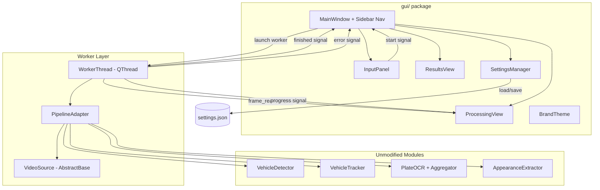
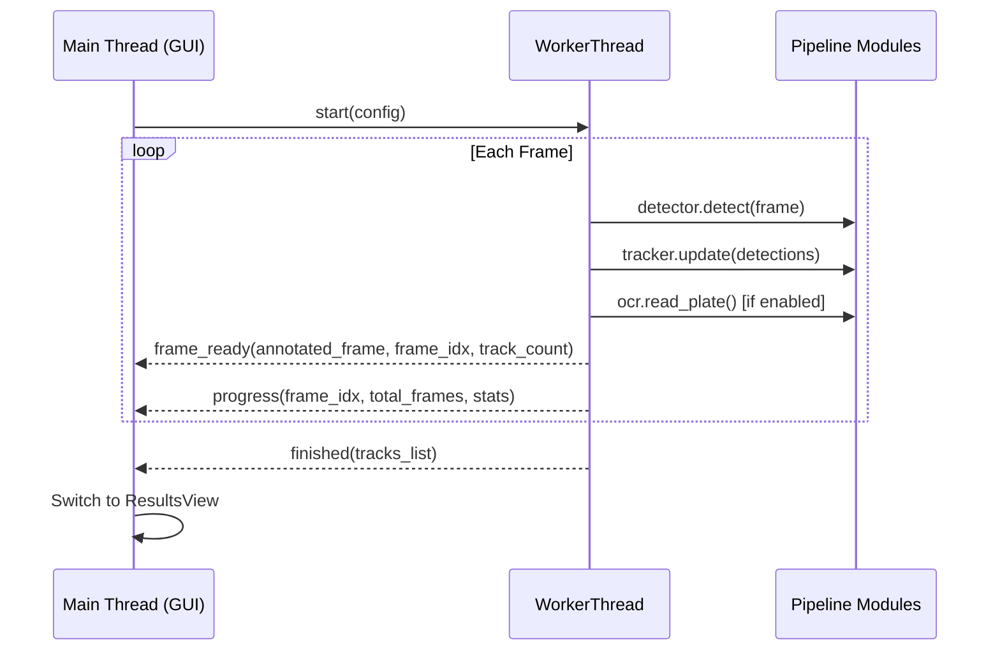
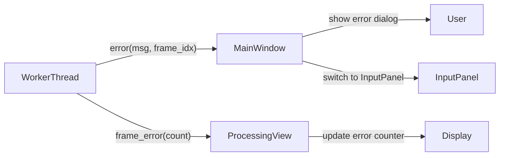

# Design Document: Opus LaneSight GUI

## Overview

The Opus LaneSight GUI is a PySide6 desktop application that wraps the existing Python vehicle detection pipeline (YOLOv8 + DeepSORT tracker + optional OCR) in a responsive graphical interface. The GUI provides video file selection, parameter configuration, live annotated processing preview, and tabular results display — all themed to the Opus brand identity.

The architecture follows a strict separation between the existing pipeline modules (which remain unmodified) and the GUI layer. A background `QThread` worker executes the pipeline frame-by-frame, emitting Qt signals that the UI consumes for live updates. Views are independent widget classes communicating exclusively through signals/slots, enabling future extensibility (RTSP input, zone editor, dashboards) without touching existing views.

**Key design decisions:**
1. **PySide6 over PyQt6** — LGPL license avoids commercial licensing requirements; API is identical.
2. **Single worker thread** — pipeline is I/O + GPU bound; one worker keeps complexity low while maintaining UI responsiveness.
3. **Adapter pattern for pipeline** — a thin `PipelineAdapter` class translates GUI parameters into pipeline constructor calls without modifying source modules.
4. **Abstract input source** — `VideoSource` protocol allows file-based input today with RTSP/RTMP swap-in later.
5. **Settings persistence via JSON** — simple, human-readable, no external dependencies.

## Architecture

### High-Level System Diagram



### Threading Model



### Module Layout

```
gui/
├── __init__.py
├── main_window.py      # MainWindow, sidebar navigation, view switching
├── input_panel.py      # Video selection, parameter controls, start button
├── processing_view.py  # Live preview, progress bar, stats, cancel
├── results_view.py     # Vehicle table, summary cards, export
├── settings.py         # SettingsManager (load/save JSON)
├── worker.py           # WorkerThread (QThread), PipelineAdapter, VideoSource
├── theme.py            # BrandTheme (stylesheet, colors, fonts)
└── resources/          # Opus logo PNG, app icon .ico
```

## Components and Interfaces

### 1. MainWindow (`main_window.py`)

Responsibilities: Application shell, sidebar navigation, view stack management, window title updates, close-during-processing confirmation, drag-and-drop handling.

```python
class MainWindow(QMainWindow):
    """Top-level application window with sidebar navigation and stacked views."""

    def __init__(self):
        # Sets up sidebar with nav entries: Input, Processing, Results
        # Initializes QStackedWidget for view switching
        # Applies BrandTheme stylesheet
        # Loads SettingsManager and restores window geometry
        ...

    def switch_view(self, view_name: str) -> None:
        """Switch the active view in the stack. Updates window title."""
        ...

    def start_processing(self, config: ProcessingConfig) -> None:
        """Create WorkerThread with config, connect signals, switch to ProcessingView."""
        ...

    def on_worker_finished(self, results: list[TrackResult]) -> None:
        """Handle pipeline completion — switch to ResultsView with results."""
        ...

    def on_worker_error(self, error_msg: str, frame_idx: int) -> None:
        """Handle pipeline error — show message, return to InputPanel."""
        ...

    def closeEvent(self, event: QCloseEvent) -> None:
        """Confirm exit during active processing."""
        ...

    def dragEnterEvent(self, event: QDragEnterEvent) -> None:
        """Accept video file drops with valid extensions."""
        ...

    def dropEvent(self, event: QDropEvent) -> None:
        """Validate dropped file and pass to InputPanel."""
        ...
```

### 2. InputPanel (`input_panel.py`)

Responsibilities: File selection dialog, video metadata display, parameter controls (confidence slider, OCR toggle, OCR settings, output path), start button state management.

```python
class InputPanel(QWidget):
    """Video input selection and processing parameter configuration."""

    # Signals
    start_requested = Signal(ProcessingConfig)

    def __init__(self, settings: SettingsManager):
        ...

    def select_video_file(self) -> None:
        """Open native file dialog filtered to MP4, AVI, MOV, MKV."""
        ...

    def validate_video(self, path: str) -> VideoMetadata | None:
        """Open with cv2.VideoCapture, read one frame, extract metadata."""
        ...

    def set_video_from_drop(self, path: str) -> None:
        """Accept a dropped file path — validates and updates UI."""
        ...

    def build_config(self) -> ProcessingConfig:
        """Collect all parameters into a ProcessingConfig dataclass."""
        ...
```

### 3. ProcessingView (`processing_view.py`)

Responsibilities: Live frame display (QLabel with QPixmap), progress bar, statistics panel, cancel button. Consumes signals from WorkerThread only.

```python
class ProcessingView(QWidget):
    """Live processing display with annotated frame preview and progress."""

    # Signals
    cancel_requested = Signal()

    def __init__(self):
        ...

    @Slot(QImage, int, int)
    def on_frame_ready(self, image: QImage, frame_idx: int, track_count: int) -> None:
        """Update the frame display with the latest annotated image."""
        ...

    @Slot(int, int, float, int, float)
    def on_progress(self, current: int, total: int, elapsed: float,
                    active_count: int, eta: float) -> None:
        """Update progress bar and statistics labels."""
        ...

    @Slot(int)
    def on_frame_error(self, error_count: int) -> None:
        """Increment and display skipped frame counter."""
        ...
```

### 4. ResultsView (`results_view.py`)

Responsibilities: Vehicle results table (sortable), summary metric cards, output file link, new session button. Handles OCR column visibility.

```python
class ResultsView(QWidget):
    """Post-processing results display with table and summary statistics."""

    # Signals
    new_session_requested = Signal()

    def __init__(self):
        ...

    def display_results(self, results: list[TrackResult], fps: float,
                        ocr_enabled: bool, output_path: str,
                        skipped_frames: int, total_frames: int) -> None:
        """Populate table and compute summary statistics."""
        ...

    def sort_by_column(self, column: int) -> None:
        """Toggle ascending/descending sort on clicked column header."""
        ...

    def open_output_folder(self) -> None:
        """Open containing folder in Windows Explorer via os.startfile."""
        ...
```

### 5. WorkerThread (`worker.py`)

Responsibilities: Execute pipeline in background thread, emit frame/progress/error/finished signals. Contains PipelineAdapter and VideoSource.

```python
class VideoSource(Protocol):
    """Abstract video input — file today, RTSP/RTMP in future."""
    def open(self, source: str) -> bool: ...
    def read(self) -> tuple[bool, np.ndarray | None]: ...
    def get_metadata(self) -> VideoMetadata: ...
    def release(self) -> None: ...

class FileVideoSource:
    """cv2.VideoCapture wrapper implementing VideoSource for local files."""
    ...

@dataclass
class ProcessingConfig:
    video_path: str
    output_path: str
    confidence: float
    ocr_enabled: bool
    ocr_languages: list[str]
    ocr_interval: int
    plate_model_path: str | None

class WorkerThread(QThread):
    """Background pipeline execution thread."""

    # Signals
    frame_ready = Signal(QImage, int, int)       # annotated frame, frame_idx, active_tracks
    progress = Signal(int, int, float, int, float)  # current, total, elapsed, active, eta
    frame_error = Signal(int)                     # cumulative error count
    finished = Signal(list)                       # list[TrackResult]
    error = Signal(str, int)                      # error message, frame_idx
    log_output = Signal(str)                      # captured stdout/stderr line

    def __init__(self, config: ProcessingConfig):
        ...

    def run(self) -> None:
        """Main processing loop — detect, track, OCR, emit signals per frame."""
        ...

    def request_cancel(self) -> None:
        """Set cancellation flag (thread-safe via QAtomicInt or threading.Event)."""
        ...
```

### 6. SettingsManager (`settings.py`)

Responsibilities: Load/save JSON at `%LOCALAPPDATA%\OpusLaneSight\settings.json`, validate ranges, provide defaults, handle missing/corrupt files gracefully.

```python
@dataclass
class AppSettings:
    confidence: float = 0.5
    ocr_enabled: bool = False
    ocr_language: str = "en"
    ocr_interval: int = 10
    output_path: str = ""
    window_width: int = 1280
    window_height: int = 800
    window_x: int | None = None
    window_y: int | None = None

class SettingsManager:
    """Manages application settings persistence."""

    CONFIG_DIR = Path(os.environ.get("LOCALAPPDATA", "")) / "OpusLaneSight"
    CONFIG_FILE = CONFIG_DIR / "settings.json"

    def __init__(self):
        self._settings = self._load()

    def get(self) -> AppSettings: ...
    def update(self, **kwargs) -> None: ...
    def save(self) -> None: ...
    def _load(self) -> AppSettings: ...
    def _validate(self, data: dict) -> AppSettings: ...
```

### 7. BrandTheme (`theme.py`)

Responsibilities: Generate Qt stylesheet string, define color constants, font setup, card styling helpers.

```python
class BrandTheme:
    """Opus brand theme constants and stylesheet generator."""

    # Colors
    TEAL_DARK = "#004851"
    TEAL = "#00968F"
    GREEN = "#93D500"
    BLUE = "#00A0E0"
    ORANGE = "#FF8200"
    CHARCOAL = "#131E29"
    GRAY = "#54565A"
    BG = "#F4F7F7"
    WHITE = "#FFFFFF"
    CARD_BORDER = "rgba(19, 30, 41, 0.08)"

    # Gradient
    HEADER_GRADIENT = "qlineargradient(x1:0, y1:0, x2:1, y2:1, stop:0 #004851, stop:0.58 #00968F, stop:1 #93D500)"

    @staticmethod
    def get_stylesheet() -> str:
        """Return the full application QSS stylesheet."""
        ...

    @staticmethod
    def apply(app: QApplication) -> None:
        """Apply theme: set font, palette, stylesheet."""
        ...
```

### 8. PipelineAdapter (within `worker.py`)

Thin adapter that bridges GUI config to pipeline module constructors without modifying them.

```python
class PipelineAdapter:
    """Adapts GUI ProcessingConfig to pipeline module initialization."""

    def __init__(self, config: ProcessingConfig):
        self.detector = VehicleDetector(
            vehicle_model_path="yolov8n.pt",
            plate_model_path=config.plate_model_path,
            confidence=config.confidence,
        )
        self.tracker = VehicleTracker(
            iou_threshold=0.3,
            max_lost=60,
            min_hits=3,
            appearance_weight=0.4,
            reid_threshold=0.45,
            gallery_max_age=300,
        )
        self.appearance = AppearanceExtractor(feature_dim=128)
        self.ocr = None
        self.aggregator = None
        if config.ocr_enabled:
            self.ocr = PlateOCR(languages=config.ocr_languages, gpu=True)
            self.aggregator = PlateTextAggregator(min_readings=3, agreement_threshold=0.4)

    def process_frame(self, frame: np.ndarray, frame_idx: int) -> tuple[np.ndarray, list, int]:
        """Process a single frame through the full pipeline.
        Returns: (annotated_frame, active_tracks, active_count)"""
        ...
```

## Data Models

### ProcessingConfig

```python
@dataclass
class ProcessingConfig:
    """Immutable configuration for a processing session."""
    video_path: str
    output_path: str
    confidence: float          # 0.1 – 1.0
    ocr_enabled: bool
    ocr_languages: list[str]   # e.g. ["en"]
    ocr_interval: int          # 1 – 100
    plate_model_path: str | None
```

### VideoMetadata

```python
@dataclass
class VideoMetadata:
    """Metadata extracted from a video file on selection."""
    file_name: str
    file_path: str
    width: int
    height: int
    frame_count: int
    fps: float
    duration_seconds: float    # frame_count / fps
```

### TrackResult

```python
@dataclass
class TrackResult:
    """Per-vehicle result computed from TrackedVehicle after processing."""
    vehicle_id: int
    plate_text: str            # empty if OCR disabled or no reading
    plate_confidence: float    # 0.0 if no reading
    first_frame: int
    last_frame: int
    enter_time: float          # first_frame / fps (seconds)
    leave_time: float | None   # last_frame / fps or None if still in frame
    wait_time: float | None    # leave_time - enter_time or None
```

### AppSettings

```python
@dataclass
class AppSettings:
    """Persisted application settings."""
    confidence: float = 0.5
    ocr_enabled: bool = False
    ocr_language: str = "en"
    ocr_interval: int = 10
    output_path: str = ""
    window_width: int = 1280
    window_height: int = 800
    window_x: int | None = None
    window_y: int | None = None
```

### Settings JSON Schema

```json
{
  "confidence": 0.5,
  "ocr_enabled": false,
  "ocr_language": "en",
  "ocr_interval": 10,
  "output_path": "",
  "window_width": 1280,
  "window_height": 800,
  "window_x": null,
  "window_y": null
}
```

Stored at: `%LOCALAPPDATA%\OpusLaneSight\settings.json`


## Correctness Properties

*A property is a characteristic or behavior that should hold true across all valid executions of a system — essentially, a formal statement about what the system should do. Properties serve as the bridge between human-readable specifications and machine-verifiable correctness guarantees.*

### Property 1: Default output path derivation

*For any* valid input video file path (with a parent directory and file name), the default output path SHALL be `"output.mp4"` located in the same directory as the input file.

**Validates: Requirements 2.7**

### Property 2: Progress percentage invariant

*For any* frame index `current` and total frame count `total` where `0 <= current <= total` and `total > 0`, the computed progress percentage SHALL equal `(current / total) * 100`, always within the range [0, 100].

**Validates: Requirements 3.4**

### Property 3: TrackResult time computation

*For any* TrackedVehicle with `first_frame >= 0`, `last_frame >= first_frame`, and `fps > 0`, the computed `enter_time` SHALL equal `first_frame / fps`, `leave_time` SHALL equal `last_frame / fps`, and `wait_time` SHALL equal `leave_time - enter_time` (non-negative).

**Validates: Requirements 4.1**

### Property 4: Summary statistics correctness with incomplete track exclusion

*For any* list of TrackResult objects, the summary statistics (average, maximum, minimum wait time) SHALL be computed exclusively from tracks that have both `enter_time` and `leave_time` (i.e., `leave_time is not None`). Tracks with `leave_time = None` SHALL be excluded from all aggregate computations. The computed average SHALL equal `sum(wait_times) / len(wait_times)`, max SHALL equal `max(wait_times)`, and min SHALL equal `min(wait_times)` for the filtered subset.

**Validates: Requirements 4.2, 4.8**

### Property 5: Default sort order

*For any* list of TrackResult objects, the default display order SHALL be ascending by `enter_time` such that for all consecutive pairs `(results[i], results[i+1])`, `results[i].enter_time <= results[i+1].enter_time`.

**Validates: Requirements 4.3**

### Property 6: Settings round-trip persistence

*For any* valid `AppSettings` instance (confidence in [0.1, 1.0], ocr_interval in [1, 100], ocr_language is a non-empty string), serializing to JSON and then deserializing SHALL produce an `AppSettings` instance with identical field values.

**Validates: Requirements 5.2**

### Property 7: Invalid settings produce valid defaults

*For any* string that is not valid JSON, or a JSON object with field values outside valid ranges, the SettingsManager SHALL return an `AppSettings` instance where all fields are within their valid ranges (confidence in [0.1, 1.0], ocr_interval in [1, 100], ocr_enabled is boolean).

**Validates: Requirements 5.3**

### Property 8: Confidence threshold clamping

*For any* floating-point value `v`, clamping to the valid confidence range SHALL produce `max(0.1, min(1.0, v))`, which is always within [0.1, 1.0].

**Validates: Requirements 8.5**

### Property 9: Frame error counter accuracy

*For any* sequence of frame-read outcomes (success or failure), the cumulative error counter SHALL equal the total number of failures in the sequence.

**Validates: Requirements 8.3**

### Property 10: File extension validation

*For any* file path string, the drag-and-drop extension validator SHALL accept the path if and only if its extension (case-insensitive) is one of `.mp4`, `.avi`, `.mov`, or `.mkv`.

**Validates: Requirements 9.6**

## Error Handling

### Error Categories and Strategies

| Category | Trigger | Strategy | User Feedback |
|---|---|---|---|
| **Startup failure** | Missing PySide6, import error | Catch `ImportError` in `__main__`, show `QMessageBox.critical` | Error dialog with dependency name, then `sys.exit(1)` |
| **Model missing** | `yolov8n.pt` not found | Check before starting worker | Error dialog suggesting file placement |
| **Invalid video file** | OpenCV cannot open or read frame | `cv2.VideoCapture.isOpened()` + `read()` check | Inline error on InputPanel |
| **Output path not writable** | Permission denied or missing dir | `os.access()` check before start | Inline error, re-enable path selector |
| **Frame-read failure** | `cap.read()` returns `(False, None)` | Skip frame, increment counter | Error count in ProcessingView stats |
| **Consecutive frame failures (>100)** | Corrupt video mid-stream | Abort processing | Error message with frame number, return to InputPanel |
| **Pipeline exception** | Unhandled exception in detection/tracking/OCR | `try/except` in WorkerThread `run()` | Error signal → dialog with exception type + frame number |
| **Settings file corrupt** | Invalid JSON or out-of-range values | Fallback to defaults, overwrite file | Silent recovery (no user disruption) |
| **Settings file not writable** | Permissions issue | In-memory operation | Non-blocking warning toast |
| **Worker cancellation** | User clicks Cancel or closes window | `threading.Event` flag checked per frame | Cancellation message, return to InputPanel |

### Error Signal Flow



### Stdout/Stderr Capture

The WorkerThread redirects `sys.stdout` and `sys.stderr` to a `QueueIO` object during processing. Captured lines are emitted via `log_output` signal to a collapsible log panel. The buffer retains at most 10,000 lines (oldest discarded via `collections.deque`).

```python
class QueueIO(io.TextIOBase):
    """Thread-safe IO wrapper that emits lines via a callback."""
    def __init__(self, callback: Callable[[str], None]):
        self._callback = callback
        self._buffer = ""

    def write(self, text: str) -> int:
        self._buffer += text
        while "\n" in self._buffer:
            line, self._buffer = self._buffer.split("\n", 1)
            self._callback(line)
        return len(text)
```

### Graceful Degradation

- If the Roboto font is not installed, fall back to system sans-serif (`Arial`, `Segoe UI`).
- If the Opus logo PNG is missing from resources, display text "OPUS" in brand font/color.
- If GPU is unavailable for OCR, fall back to CPU mode silently (EasyOCR handles this internally).

## Testing Strategy

### Dual Testing Approach

The testing strategy combines:
1. **Property-based tests** — verify universal invariants across generated inputs for pure logic functions
2. **Unit tests** — verify specific examples, edge cases, and UI widget behavior
3. **Integration tests** — verify end-to-end flows with mocked pipeline

### Property-Based Testing Configuration

**Library:** [Hypothesis](https://hypothesis.readthedocs.io/) (Python PBT library, well-maintained, MIT license)

**Configuration:**
- Minimum 100 examples per property test (`@settings(max_examples=100)`)
- Each test tagged with design property reference
- Tag format: `# Feature: lanesight-gui, Property {N}: {title}`

**Test file:** `tests/test_gui_properties.py`

### Property Test Targets

| Property | Function Under Test | Generator Strategy |
|---|---|---|
| 1: Default output path | `derive_default_output_path(input_path)` | `st.from_regex(r'[A-Za-z]:\\[\\w\\\\]+\\.mp4')` |
| 2: Progress percentage | `compute_progress(current, total)` | `st.integers(0, 10000)` for both |
| 3: TrackResult computation | `build_track_result(vehicle, fps)` | `st.builds(TrackedVehicle, ...)` |
| 4: Summary statistics | `compute_summary(results)` | `st.lists(st.builds(TrackResult, ...))` |
| 5: Default sort | `sort_results_default(results)` | `st.lists(st.builds(TrackResult, ...))` |
| 6: Settings round-trip | `SettingsManager.save()` → `load()` | `st.builds(AppSettings, ...)` |
| 7: Invalid settings defaults | `SettingsManager._load(raw_json)` | `st.text()` + `st.dictionaries(...)` |
| 8: Confidence clamping | `clamp_confidence(value)` | `st.floats(-100, 100)` |
| 9: Frame error counter | `count_errors(outcomes)` | `st.lists(st.booleans())` |
| 10: Extension validation | `is_valid_video_extension(path)` | `st.text()` + known extensions |

### Unit Test Targets

| Component | Test Focus |
|---|---|
| `InputPanel` | Widget state (button enabled/disabled), OCR controls visibility |
| `ProcessingView` | Progress bar value updates, stats label formatting |
| `ResultsView` | Table column count, column visibility with OCR on/off, empty state |
| `SettingsManager` | Directory creation, default values, file corruption recovery |
| `BrandTheme` | Stylesheet contains expected color hex values |
| `MainWindow` | View switching, window title format, drag-and-drop acceptance |

### Integration Test Targets

| Flow | Approach |
|---|---|
| Full processing session | Mock `VehicleDetector` to return canned detections, verify signals emitted |
| Cancellation flow | Start worker, cancel after N frames, verify thread stops |
| Error propagation | Inject exception in mocked detector, verify error signal reaches UI |
| Settings persistence | Write settings, relaunch manager, verify values match |

### Test Execution

```bash
# Run all tests
pytest tests/ -v

# Run property tests only
pytest tests/test_gui_properties.py -v

# Run with Hypothesis verbose output
pytest tests/test_gui_properties.py --hypothesis-show-statistics
```

### Coverage Goals

- Property tests cover all 10 correctness properties
- Unit tests cover widget construction and state transitions
- Integration tests cover the worker→signal→view pipeline
- No tests require a running display server (use `QApplication` with `offscreen` platform plugin via `QT_QPA_PLATFORM=offscreen`)

