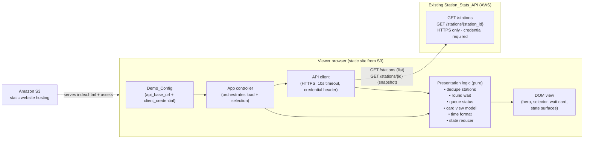
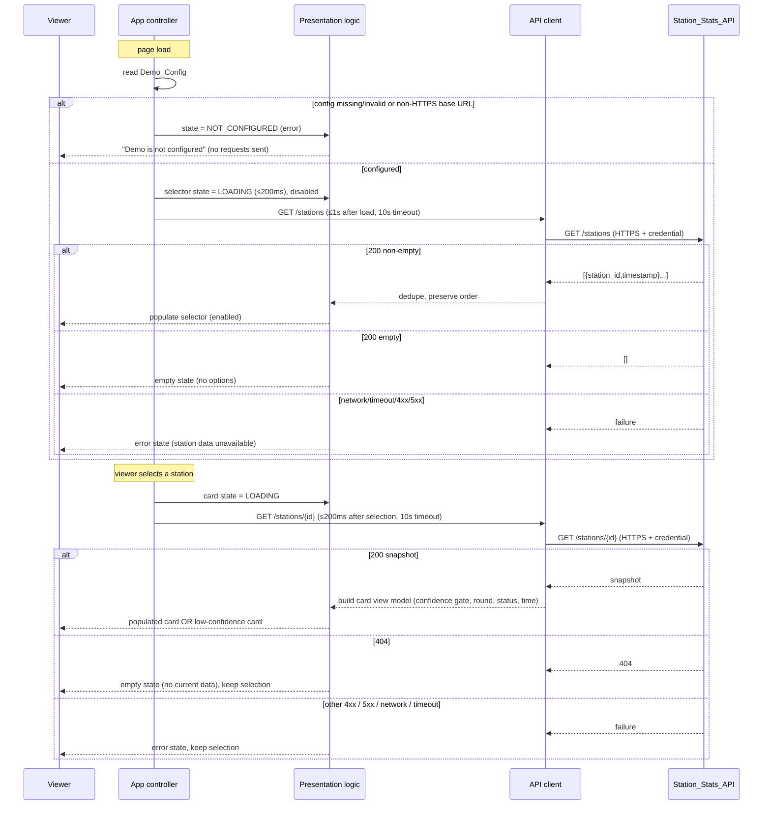
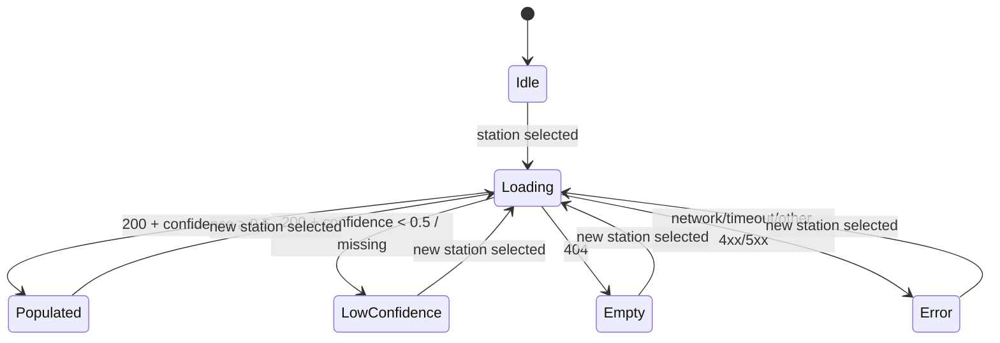

# Design Document

## Overview

The Public Stats Dashboard is a static, single-page demo website served from Amazon S3 static website hosting. It demonstrates the motorist-facing wait-time experience for Opus LaneSight by letting a viewer pick an inspection station from a dropdown and see that station's current wait-time information as a motorist-friendly public wait-time card.

The site computes no statistics of its own. It is a thin, read-only client of the existing `Station_Stats_API` (defined in the sibling `station-stats-api` spec). On load it calls `GET /stations` to discover which stations have a stored snapshot and to populate the `Station_Selector`; when a station is selected it calls `GET /stations/{station_id}` to fetch that station's current `Station_Metric_Snapshot`. Both endpoints require a `Client_Credential` and are HTTPS-only.

All behavior runs in the viewer's browser. The page is composed of static assets only (HTML, CSS, JavaScript, images) and depends on no server-side application code other than the `Station_Stats_API`. The displayed card follows the Opus UI guidelines: Roboto type, the Opus color palette, a gradient hero, the Opus card style, sentence-case headings, and a status color paired with a visible text label. It deliberately hides internal model jargon — confidence scores, raw field names, and secondary metrics never reach the screen.

The page must visibly handle every interaction state from the UI guidelines: **loading**, **empty** (no stations or no data), **low-confidence** (public estimate withheld), and **error** (API unreachable). Exactly one card state is shown at a time.

### Design goals

1. **Static and serverless** — only static assets on S3; no application server beyond the `Station_Stats_API`.
2. **Read-only and faithful** — the dashboard never computes wait times; it only presents what the API stored, applying motorist-facing formatting rules.
3. **Honest absence** — loading, empty, low-confidence, and error states are explicit and never leave a blank or misleading screen.
4. **Motorist-simple** — no internal jargon, no false precision ("18 minutes", not "18.42 minutes"), status communicated by label + color (never color alone).
5. **Credential hygiene within a known constraint** — the credential is never rendered into visible output; the demo-only nature of embedding it in a public asset is explicitly documented.

### Scope

In scope: S3 static hosting shape, demo configuration and credential handling, station-list retrieval and selector population (including de-duplication), per-station snapshot retrieval and card rendering, the public wait-time card content and formatting (rounding, queue status, local-time timestamp), low-confidence withholding, the Opus visual treatment, and the loading/empty/low-confidence/error/populated interaction states.

Out of scope: the internal operations dashboard, the computer-vision pipeline, Bedrock summaries, the API's own ingestion/storage/auth internals (owned by `station-stats-api`), and any write path. The shape of the `Station_Metric_Snapshot` and the API contract are given inputs.

### Security note — credential in a public static site (Req 2.7)

The `Station_Stats_API` requires a `Client_Credential`, but the dashboard is a public static asset whose JavaScript and network traffic are fully visible to any visitor. **Embedding a `Client_Credential` in a publicly hosted static site exposes that credential to every visitor and is not safe for production use.** This is accepted only because the artifact is a throwaway hackathon demo. The `Demo_Config` mechanism is therefore explicitly a *demo-only* convenience. The credential is kept out of all viewer-visible output (on-screen text, displayed URLs, visible request parameters), but it cannot be kept out of the browser itself. A production deployment would front the API with a backend-for-frontend, a short-lived token broker, or a public read scope that requires no secret — none of which are built here.

## Architecture

### High-level component diagram



### Hosting shape

- The site is published as static objects (`index.html` as the index document, `styles.css`, `app.js`, the pure-logic modules, an `error.html`, and the official Opus logo image) to an S3 bucket configured for static website hosting (Req 1.1).
- `index.html` is the index document and renders the page shell, gradient hero, station selector, and an initially empty card region synchronously so the initial layout paints within 3 seconds over a ≥5 Mbps connection (Req 1.2).
- No bundler or framework is required. The implementation uses plain ES modules so each pure-logic module can be unit- and property-tested directly. This keeps the deployable a flat set of static files and avoids a build step on the critical path (aligns with Req 1.1, 1.3).

### Endpoints consumed (from `station-stats-api`)

| Purpose | Method | Path | Success | Absence / error |
|---|---|---|---|---|
| Discover stations | GET | `/stations` | `200` + list of `{station_id, timestamp}` (possibly empty) | network/timeout/4xx/5xx → error |
| Fetch one snapshot | GET | `/stations/{station_id}` | `200` + `Station_Metric_Snapshot` | `404` → empty; other 4xx (non-404)/5xx/network/timeout → error |

All requests are sent over HTTPS with the `Client_Credential` attached as a request header, and each request applies a 10-second timeout (Req 1.4, 1.5, 2.2, 2.3).

### Load and selection lifecycle



### Layered responsibilities and why

- **Demo_Config** isolates the only environment-specific values (base URL + credential) so the rest of the code is pure and testable, and so credential handling is concentrated in one place (Req 2.1, 2.6).
- **API client** is the single seam that touches the network: it enforces HTTPS, attaches the credential, applies the 10-second timeout, and maps transport outcomes to a small typed result (`OK | NOT_FOUND | FAILURE`). Property tests replace it with an in-memory fake so presentation logic is verified without network calls (Req 1.4, 1.5, 4.5, 4.6).
- **Presentation logic** is a set of pure functions — station de-duplication, wait rounding, queue-status derivation, the card view model (including the confidence gate), local-time formatting, and the interaction-state reducer. This is where the testable correctness lives.
- **DOM view** renders whatever the presentation logic produces. It owns no business rules, so visual concerns (gradient, fonts, contrast) are verified by snapshot/manual checks rather than property tests.

## Components and Interfaces

### Demo_Config

A small configuration object loaded before any request. For the demo it is provided by a non-bundled `config.js` that assigns `window.OPUS_DEMO_CONFIG`. The loader validates it.

```js
// Shape of Demo_Config
// { apiBaseUrl: string, clientCredential: string }

/**
 * Validate demo configuration.
 * Returns { ok: true, config } when both values are non-empty AND
 * apiBaseUrl uses the https: scheme; otherwise { ok: false }.
 */
function loadDemoConfig(raw) // -> { ok: boolean, config?: {apiBaseUrl, clientCredential} }
```

- If `apiBaseUrl` or `clientCredential` is missing/empty, or `apiBaseUrl` is not HTTPS, the result is `{ ok: false }` and the app enters the NOT_CONFIGURED error state without issuing any request (Req 2.4, 2.5).
- The credential value is read here and passed only to the API client's header builder; it is never written into DOM text, the visible selected-station label, or any displayed URL (Req 2.6).

### API client

```js
/**
 * Result type: { kind: "OK", body } | { kind: "NOT_FOUND" } | { kind: "FAILURE", reason }
 * reason ∈ { "network", "timeout", "http4xx", "http5xx" }
 */
async function getStations(config)              // GET /stations
async function getStation(config, stationId)    // GET /stations/{id}
```

- Builds the request URL from `config.apiBaseUrl`; refuses to send if the URL is not HTTPS (defense in depth alongside config validation) (Req 1.4, 2.3).
- Attaches the `Client_Credential` as a request header (Req 2.2).
- Applies a 10-second timeout via `AbortController`; a timed-out request resolves to `FAILURE/timeout` (Req 1.5).
- Maps `404` on the single-station path to `NOT_FOUND` (distinct from other failures) so the card can show the empty state rather than an error (Req 4.5).

### Presentation logic (pure functions)

```js
/** Req 3.2, 3.3 — keep first occurrence of each station_id, preserve order. */
function dedupeStations(list) // -> Array<{station_id, timestamp}>

/** Req 5.2, 6.x — round to nearest whole minute, halves up, clamped to a
 *  non-negative integer. Returns null for null/NaN/non-finite input. */
function roundWaitMinutes(value) // -> number | null

/** Req 6.1–6.4 — derive status from a rounded, non-negative wait value.
 *  null/undefined -> "Data unavailable"/gray. */
function deriveQueueStatus(roundedWait) // -> { label, color }

/** Req 4.3, 5.x, 7.x — build the card view model from a snapshot. */
function buildCardViewModel(snapshot, threshold = 0.5) // -> CardViewModel

/** Req 5.4 — 12-hour local clock with AM/PM; no date, seconds, or offset. */
function formatLocalTime(iso8601) // -> string

/** Req 9.5 — reduce events to exactly one card state. */
function nextCardState(current, event) // -> CardState
```

The card view model is the central unit under property test:

```js
// CardViewModel
// {
//   state: "POPULATED" | "LOW_CONFIDENCE",
//   stationName: string,
//   waitDisplay: { minutes: number, label: "minutes" } | null, // null => withheld
//   queueStatus: { label: string, color: string },             // always present
//   openLanes: number,                                         // active_lanes
//   lastUpdated: string,                                       // formatLocalTime(timestamp)
//   attribution: "Powered by Opus LaneSight"
// }
```

`buildCardViewModel` rules:

1. **Confidence gate (Req 7.1, 7.4, 7.5):** if `confidence_score` is missing/null **or** `< threshold (0.5)`, the model is `LOW_CONFIDENCE`: `waitDisplay = null` (no numeric wait rendered), `queueStatus = {label: "Data unavailable", color: "#54565A"}`, and the view renders non-technical "estimate temporarily unavailable" copy with no score, metric, or model jargon (Req 7.2, 7.3).
2. **Populated (Req 5.1–5.4, 6.1–6.3):** otherwise `waitDisplay.minutes = roundWaitMinutes(estimated_public_wait_minutes)` and `queueStatus = deriveQueueStatus(waitDisplay.minutes)`. If the estimate itself is null/unavailable even at acceptable confidence, the status falls back to "Data unavailable" and the wait is withheld (Req 6.4).
3. **Always excludes** `confidence_score`, `slowest_lane_id`, `average_inspection_minutes`, `average_queue_wait_minutes`, `throughput_per_hour`, `vehicles_in_bay`, and all raw field names from the model (Req 5.5).
4. `openLanes = active_lanes` as a whole-number count (Req 5.3); `lastUpdated = formatLocalTime(timestamp)` (Req 5.4); `attribution` is the fixed string (Req 5.1).

### DOM view

Renders the page shell and the current state. It exposes one entry point per region:

```js
function renderSelector(state, stations)   // loading | populated(options) | empty | error
function renderCard(cardState, viewModel)  // loading | populated | low-confidence | empty | error
```

- The view binds the selector `change` event to the app controller, which triggers the single-station fetch within 200 ms (Req 4.1).
- Every status color is rendered together with its visible text label (left-border + label chip), never color alone (Req 6.5, 8.8).
- The view never shows a numeric wait value while in loading, empty, low-confidence, or error states (Req 9.1, 9.2, 9.4).

### App controller

Orchestrates the lifecycle: read config → (validate) → load stations → handle selection. It owns the state transitions but delegates all derivations to the presentation logic and all I/O to the API client. It guarantees that selecting a different station clears any prior loading/empty/error card state before showing the new station's result (Req 4.4), and that the card shows exactly one state at a time (Req 9.5).

## Data Models

### Station list entry (from `GET /stations`)

```json
{ "station_id": "demo_station_01", "timestamp": "2026-06-12T13:45:00-08:00" }
```

The list is an array of these entries (1–500 expected; possibly empty). Only `station_id` is used to build selector options; `timestamp` is carried but not required for the selector. De-duplication keeps the first occurrence of each `station_id` and preserves returned order (Req 3.2, 3.3).

### Station_Metric_Snapshot (from `GET /stations/{station_id}`)

The full snapshot as defined by `station-stats-api`. The dashboard reads only the motorist-relevant fields and ignores the rest:

| Field | Used by dashboard | Purpose |
|---|---|---|
| `station_id` | yes | station name / label |
| `timestamp` | yes | last-updated (formatted to local 12-hour time) |
| `active_lanes` | yes | open-lane count |
| `estimated_public_wait_minutes` | yes | rounded wait display + queue status |
| `confidence_score` | yes (gate only) | low-confidence withholding; never displayed |
| `vehicles_in_queue` | no | not shown |
| `vehicles_in_bay` | no | excluded (Req 5.5) |
| `average_queue_wait_minutes` | no | excluded (Req 5.5) |
| `average_inspection_minutes` | no | excluded (Req 5.5) |
| `throughput_per_hour` | no | excluded (Req 5.5) |
| `slowest_lane_id` | no | excluded (Req 5.5) |

> Note: the requirements use "station name" for display. The API contract exposes `station_id`, not a separate display name. For the demo the card derives the displayed station name from `station_id` (a presentation concern); the same `station_id` value identifies the selected station for retrieval.

### Queue status mapping (Req 6.1–6.4)

Status is derived from the **rounded** wait `r` (nearest whole minute, halves up):

| Condition on rounded wait `r` | Label | Color token |
|---|---|---|
| `0 ≤ r ≤ 10` | Normal wait | `#93D500` (green) |
| `10 < r ≤ 25` | Moderate wait | `#00A0E0` (blue) |
| `r > 25` | Queue building | `#FF8200` (orange) |
| wait unavailable / null / not determinable | Data unavailable | `#54565A` (gray) |

Orange is used only for the "Queue building" attention state, consistent with the guideline that orange is reserved for attention/warning (Req 8.3).

### Rounding rule (Req 5.2)

`roundWaitMinutes(x)` = `max(0, Math.floor(x + 0.5))` for finite numeric `x`, yielding a non-negative integer with no decimals; returns `null` for `null`, `NaN`, or non-finite input so the caller withholds the value and shows "Data unavailable".

### Timestamp formatting (Req 5.4)

`formatLocalTime(iso)` parses the ISO 8601 snapshot timestamp (which carries an explicit offset or `Z`) to an instant, then renders it in the viewer's local time zone as a 12-hour clock with an AM/PM indicator and no date, no seconds, and no UTC offset — e.g. `1:42 PM`.

### Interaction state model (Req 9.5)

The card is a state machine with exactly one active state:



The selector has its own parallel state (loading / populated / empty / error) for the list fetch. NOT_CONFIGURED is an app-level error state that pre-empts all fetching.

### Demo_Config model

```js
// Provided demo-only via window.OPUS_DEMO_CONFIG (non-bundled config.js)
// { apiBaseUrl: "https://api.example.com", clientCredential: "<demo key>" }
```

Validated to require a non-empty HTTPS `apiBaseUrl` and a non-empty `clientCredential`; the credential is held in memory and passed only to the API client's header builder, never to the view (Req 2.1, 2.4, 2.5, 2.6).

## Correctness Properties

*A property is a characteristic or behavior that should hold true across all valid executions of a system — essentially, a formal statement about what the system should do. Properties serve as the bridge between human-readable specifications and machine-verifiable correctness guarantees.*

This feature's pure presentation logic is a strong fit for property-based testing: station de-duplication, wait rounding, queue-status derivation, the card view model, the confidence gate, timestamp formatting, and the interaction-state reducer are all pure functions over large input spaces with clear universal properties. The network, hosting, fonts, gradient, layout, and contrast concerns do not vary meaningfully with input and are covered by integration, smoke, and snapshot tests in the Testing Strategy. The properties below were consolidated during prework reflection so each adds unique validation value.

### Property 1: Station de-duplication keeps first occurrence and preserves order

*For any* list of station entries returned by `GET /stations`, the selector options are exactly the unique `station_id` values in their first-seen order — every `station_id` appears once, the first occurrence is retained, later duplicates are discarded, and the relative order of first occurrences is unchanged.

**Validates: Requirements 3.2, 3.3**

### Property 2: Wait rounding is round-half-up to a non-negative integer

*For any* finite numeric `estimated_public_wait_minutes` value `x ≥ 0`, `roundWaitMinutes(x)` equals `floor(x + 0.5)`, is a non-negative integer with no fractional part; and for any `null`, `NaN`, or non-finite input the function returns `null` so no numeric wait is displayed.

**Validates: Requirements 5.2**

### Property 3: Queue status is correct across all ranges, always labelled, and orange-restricted

*For any* rounded wait value `r`: `0 ≤ r ≤ 10` yields "Normal wait"/`#93D500`; `10 < r ≤ 25` yields "Moderate wait"/`#00A0E0`; `r > 25` yields "Queue building"/`#FF8200`; and a `null`/unavailable wait yields "Data unavailable"/`#54565A`. In every case the result carries a non-empty text label paired with its color, and the orange color `#FF8200` is produced only together with the "Queue building" attention label.

**Validates: Requirements 6.1, 6.2, 6.3, 6.4, 6.5, 8.3, 8.8**

### Property 4: Confidence gating withholds low-confidence estimates

*For any* `Station_Metric_Snapshot`, when `confidence_score` is missing, null, or strictly less than the `Confidence_Threshold` of 0.5, `buildCardViewModel` produces the `LOW_CONFIDENCE` state with `waitDisplay = null` (no numeric wait), `queueStatus = "Data unavailable"/#54565A` with a visible label, and contains no internal metric, score, raw field name, or model jargon; and when `confidence_score ≥ 0.5` with a determinable estimate it produces the `POPULATED` state with a wait display and a status derived from the rounded wait.

**Validates: Requirements 7.1, 7.2, 7.3, 7.4, 7.5, 9.4**

### Property 5: Populated card contains exactly the motorist-facing fields

*For any* acceptable-confidence snapshot, the populated card view model and its rendered output include the station name, the rounded `Estimated_Wait_Display` with a minutes label, the queue status label, the open-lane count equal to `active_lanes`, the last-updated timestamp, and the text "Powered by Opus LaneSight"; and the output contains none of `confidence_score`, `slowest_lane_id`, `average_inspection_minutes`, `average_queue_wait_minutes`, `throughput_per_hour`, `vehicles_in_bay`, nor any raw snapshot field name.

**Validates: Requirements 4.3, 5.1, 5.3, 5.5**

### Property 6: Timestamp renders as 12-hour local time without date, seconds, or offset

*For any* valid ISO 8601 timestamp with an explicit offset or `Z`, `formatLocalTime` returns a string matching a 12-hour clock with an AM/PM indicator (pattern `^\d{1,2}:\d{2}\s(AM|PM)$`) that contains no date component, no seconds, and no UTC offset.

**Validates: Requirements 5.4**

### Property 7: Every configured request is HTTPS and carries the credential

*For any* valid `Demo_Config` and any endpoint the dashboard calls, the request the API client constructs uses the `https:` scheme and includes the configured `Client_Credential` as a request header.

**Validates: Requirements 2.2, 2.3, 1.4**

### Property 8: Invalid configuration is rejected and blocks all requests

*For any* `Demo_Config` in which the base URL is empty, the credential is empty, or the base URL does not use the HTTPS scheme, configuration validation fails, the app enters the not-configured error state, and no request is issued to the `Station_Stats_API`.

**Validates: Requirements 2.4, 2.5**

### Property 9: The credential never appears in viewer-visible output

*For any* `Client_Credential` value, no string produced for display — card view model fields, selector option text, status labels, any displayed URL, or visible request parameters — contains the credential value.

**Validates: Requirements 2.6**

### Property 10: Request outcomes map to the correct interaction state

*For any* outcome of a station request: a `200` snapshot maps the card to populated or low-confidence (per Property 4); a `404` on the single-station path maps the card to the empty state while retaining the selected station; and a network error, timeout, other 4xx, or 5xx maps the card to the error state while retaining the selected station. For the station-list request, any network error, timeout, 4xx, or 5xx maps the selector to the error state, and an empty list maps it to the empty state with no selectable options.

**Validates: Requirements 3.5, 3.6, 4.5, 4.6**

### Property 11: Exactly one card state is active and selection always clears the prior state

*For any* sequence of interaction events, the card reducer yields exactly one active state from {loading, empty, low-confidence, error, populated}; and a new-selection event always transitions the card to the loading state, clearing any prior loading, empty, or error state before the new station's result is shown.

**Validates: Requirements 4.4, 9.5**

### Property 12: An error state persists until a later request succeeds

*For any* sequence of request outcomes, once the dashboard enters the error state due to a connection failure or timeout, it remains in the error state until a subsequent successful request occurs, at which point the error state is cleared.

**Validates: Requirements 9.3**

### Property 13: Non-populated states never show a numeric wait or internal terminology

*For any* loading, empty, low-confidence, or error render, the output contains no numeric wait-time value and no internal model, detection, or error terminology; and the empty render additionally contains motorist-facing copy explaining that wait-time data will appear when station activity resumes.

**Validates: Requirements 9.1, 9.2**

## Error Handling

### Configuration errors (pre-flight)

| Condition | Behavior | Requirement |
|---|---|---|
| Missing/empty `apiBaseUrl` or `clientCredential` | NOT_CONFIGURED error state; no request issued | 2.4 |
| `apiBaseUrl` not HTTPS | NOT_CONFIGURED error state; no request issued | 2.5 |

The not-configured state uses motorist-neutral copy ("This demo is not configured") and never reveals the credential or internal detail.

### Station-list request (`GET /stations`)

| Outcome | Selector state | Requirement |
|---|---|---|
| `200` non-empty | Populated with deduped options (first-seen order) | 3.2, 3.3 |
| `200` empty list | Empty state, no selectable options | 3.5 |
| network error / 10s timeout / 4xx / 5xx | Error state ("station data is currently unavailable") | 3.6 |

While the request is in flight the selector shows a loading state within 200 ms and is disabled until the response is handled (Req 3.4).

### Single-station request (`GET /stations/{id}`)

| Outcome | Card state | Selection | Requirement |
|---|---|---|---|
| `200` + `confidence_score ≥ 0.5` | Populated card | retained | 4.3, 7.4 |
| `200` + low/missing confidence | Low-confidence card (wait withheld) | retained | 7.1, 7.5, 9.4 |
| `404` | Empty state ("no current wait-time data") | retained | 4.5 |
| other 4xx / 5xx / network / 10s timeout | Error state ("wait-time data is currently unavailable") | retained | 4.6 |

### State persistence and exclusivity

- The card and selector each show exactly one state at a time (Req 9.5).
- An error state caused by a connection failure or timeout persists until a later request succeeds (Req 9.3).
- Selecting a different station always routes through the loading state, clearing any prior loading/empty/error card content first (Req 4.4).

### Defensive parsing

- A `200` response whose body cannot be parsed as a snapshot, or which is missing required display fields, is treated as low-confidence (wait withheld) rather than rendering partial/garbled values — consistent with the confidence gate's "treat as unavailable" stance (Req 6.4, 7.5).
- The credential is never echoed in any error message, displayed URL, or log surface visible to the viewer (Req 2.6).

## Testing Strategy

A dual approach is used. Property-based tests verify the universal presentation logic; unit, integration, smoke, and snapshot tests cover concrete examples, network wiring, hosting, timing, and visual/accessibility concerns.

### Property-based tests

- **Library:** [fast-check](https://github.com/dubzzz/fast-check) with the [Vitest](https://vitest.dev/) test runner. fast-check is the standard JavaScript property-based testing library and integrates directly with Vitest; property testing is **not** implemented from scratch. (The sibling `station-stats-api` uses Hypothesis because it is Python; this dashboard is browser JavaScript, so fast-check is the appropriate counterpart.)
- **Iterations:** each property test runs a minimum of 100 examples (`fc.assert(fc.property(...), { numRuns: 100 })` or higher).
- **Targets — the pure logic seams:** `dedupeStations`, `roundWaitMinutes`, `deriveQueueStatus`, `buildCardViewModel` (including the confidence gate), `formatLocalTime`, the API client's request builder (URL scheme + credential header), `loadDemoConfig`, and the card/selector state reducers. The network is replaced with an in-memory fake client so 100+ iterations stay cheap and deterministic.
- **Generators:** snapshot generators produce valid snapshots and boundary values for the wait thresholds (0, 10, the 10/11 boundary, 25, 26, large values), halves around the rounding rule (e.g. `x.5`), `null`/`NaN`/missing estimates, confidence values straddling 0.5 (including missing `confidence_score`), station lists with duplicates and varied order (1–500 entries, plus empty), ISO timestamps with assorted offsets and `Z`, and credential-like strings asserted absent from any displayed output.
- **Tagging:** each property test carries a comment referencing its design property:
  `// Feature: public-stats-dashboard, Property {number}: {property_text}`
- **Coverage:** Properties 1–13 above each map to a single property-based test.

### Unit and example tests

- Backoff-free fixed config: the request timeout equals 10 seconds and a slow response aborts as a timeout failure (Req 1.5).
- The list fetch is triggered on load completion and the snapshot fetch on selection (Req 3.1, 4.1).
- Concrete queue-status boundary examples: 10 → Normal, 11 → Moderate, 25 → Moderate, 26 → Queue building (Req 6.1–6.3).
- Concrete timestamp examples: `2026-06-12T13:45:00-08:00` and the same instant as `...Z` both format to a 12-hour `h:mm AM/PM` string with no date/seconds/offset (Req 5.4).
- Empty-list selector renders the empty state with zero options (Req 3.5).

### Integration tests (1–3 examples each — NOT property tests)

These verify wiring and external behavior that does not vary meaningfully with input, using a stubbed/mock API and a headless browser:

- HTTPS-only: a non-HTTPS base URL is rejected before any fetch; configured fetches go to `https://…` (Req 1.4, 2.3, 2.5).
- Credential is attached to outgoing requests and absent from rendered DOM and displayed URLs (Req 2.2, 2.6).
- 404 on the snapshot path renders the empty state and keeps the selection; a 5xx renders the error state and keeps the selection (Req 4.5, 4.6).
- Error state persists across a failed request and clears after a later success (Req 9.3).
- Initial layout renders within 3 seconds over a ≥5 Mbps (throttled) connection (Req 1.2); the loading state appears within 500 ms / 200 ms windows (Req 9.1, 3.4).

### Snapshot and accessibility tests (visual/style — NOT property tests)

- Snapshot of the page shell asserts the Roboto font stack with Arial/Helvetica/sans-serif fallback (Req 8.1), the Opus palette tokens (Req 8.2), the gradient hero (Req 8.5), the Opus card style (Req 8.6), and sentence-case headings (Req 8.4).
- An automated contrast audit (e.g. axe) verifies ≥4.5:1 for body text and ≥3:1 for large text against their backgrounds (Req 8.7).
- A DOM assertion verifies every status indicator pairs its color with a visible text label (Req 6.5, 8.8) — complementing the label-presence guarantee in Property 3.

### Smoke tests (single execution)

- The deployable is a flat set of static assets and the S3 bucket is configured for static website hosting with `index.html` as the index document (Req 1.1, 1.3).
- The design records the demo-only credential constraint (Req 2.7) — verified by review of this document's Overview.
