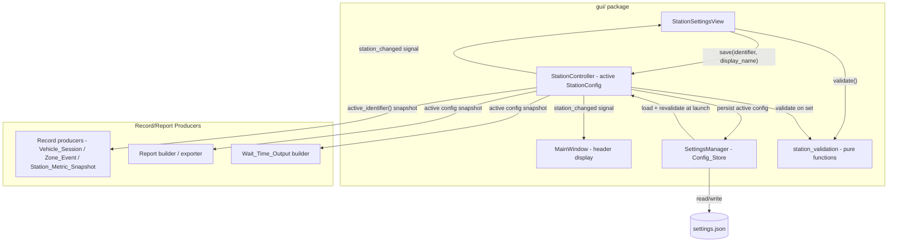
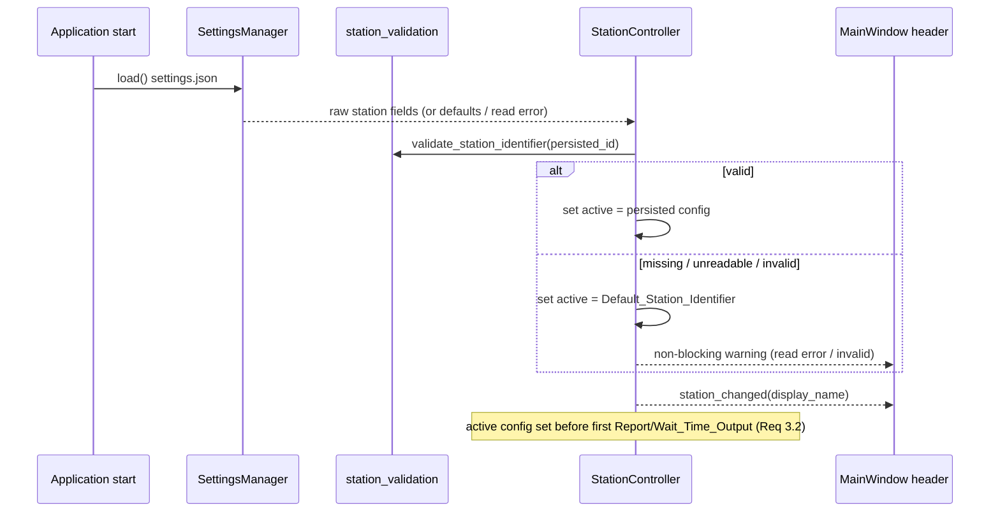
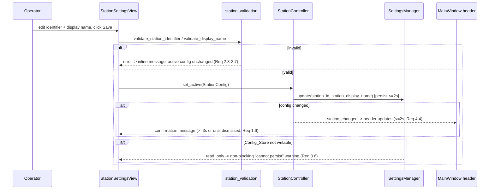

# Design Document: Station Identification

## Overview

The Station Identification feature gives an operator a single, persisted place to declare which physical inspection station a running Opus LaneSight instance represents. It replaces the hard-coded `"demo_station_01"` literal that currently appears in the data model (`Vehicle_Session.station_id`, `Zone_Event.station_id`, `Station_Metric_Snapshot.station_id`) with an explicit, validated, operator-configured value that is surfaced in the GUI header and carried into every produced record, report, and wait-time payload.

The design extends the existing `gui/` PySide6 application defined in the [lanesight-gui spec](../lanesight-gui/design.md) rather than introducing a new subsystem. It reuses three established patterns from that design:

1. **JSON persistence via the Config_Store** — the existing `SettingsManager` (`gui/settings.py`) already owns `%LOCALAPPDATA%\OpusLaneSight\settings.json`, performs load/validate/clamp/save with graceful degradation, and exposes a `read_only` flag when the file cannot be written. Station fields are added to `AppSettings` and validated in the same `_validate` pipeline.
2. **Branded header shell** — `MainWindow._build_header()` already renders the Opus logo, product name, and descriptor on every view. The active Station_Display_Name is added there (Requirement 4) per the UI guideline that the header shows the station name.
3. **Signals/slots decoupling** — a small `StationController` owns the active `StationConfig` and emits a Qt signal when it changes, so the header and any future view update without direct coupling (mirrors the worker→view wiring already used in `MainWindow`).

**Key design decisions:**

1. **A single source of truth for the active station.** A `StationController` holds the active `StationConfig` in memory and is the only object the rest of the app reads from. This makes "the active identifier at the moment a record is created" (Requirement 5) a well-defined, testable concept.
2. **Pure validation functions.** Identifier and display-name validation are pure functions (`validate_station_identifier`, `validate_display_name`, `effective_display_name`) with no Qt dependency, so they are unit- and property-testable in isolation and reusable by both the UI (live save) and the Config_Store (load-time revalidation).
3. **Capture-by-value at record creation.** Records and wait-time payloads receive a snapshot of the `Station_Identifier` string (an immutable `str`) taken at creation time, never a live reference to the controller. A later change to the active config cannot mutate an already-created record (Requirement 5.5).
4. **Stable wire field names.** A module-level constant defines the JSON field names used in Wait_Time_Output (`station_id`, `station_display_name`) so they remain fixed across releases (Requirement 7.3, 7.4) and match the existing data-model field name `station_id` in `product_overview`.
5. **Default fallback is centralized.** `DEFAULT_STATION_IDENTIFIER = "demo_station_01"` is defined once and used by load-time fallback, validation-failure fallback, and the "no active config" report path, preserving continuity with the existing literal.

## Architecture

### Component relationships



### Launch and save sequences





## Components and Interfaces

### 1. Station validation (`gui/station_validation.py`)

Pure, Qt-free functions shared by the UI and the Config_Store. Centralizing them satisfies the requirement that load-time revalidation uses the same rules as the save path (Requirement 3.5 references Requirement 2).

```python
DEFAULT_STATION_IDENTIFIER = "demo_station_01"

IDENTIFIER_MAX_LEN = 64
DISPLAY_NAME_MAX_LEN = 128
HEADER_DISPLAY_MAX_LEN = 40

# Allowed identifier characters: lowercase letters, digits, hyphen, underscore.
_IDENTIFIER_RE = re.compile(r"^[a-z0-9_-]{1,64}$")


class IdentifierError(Enum):
    EMPTY = "empty"            # empty or whitespace-only (Req 2.3)
    TOO_LONG = "too_long"      # > 64 chars (Req 2.5)
    BAD_CHARSET = "bad_charset"  # 1-64 chars but illegal characters (Req 2.4)


def validate_station_identifier(value: str) -> IdentifierError | None:
    """Return None when value is a valid Station_Identifier, else the specific
    error. Valid iff 1-64 chars and only [a-z0-9_-] (Req 2.1).

    Order of checks fixes the error message shown:
      - empty/whitespace-only            -> EMPTY      (Req 2.3)
      - length > 64                      -> TOO_LONG   (Req 2.5)
      - illegal chars within 1-64 length -> BAD_CHARSET(Req 2.4)
    """
    ...


def validate_display_name(value: str) -> bool:
    """Return True iff len(value) <= 128 (Req 2.6). 0 length is valid (Req 2.7)."""
    ...


def effective_display_name(identifier: str, display_name: str) -> str:
    """Return the user-facing label: the display name when it has non-whitespace
    content, otherwise the identifier (Req 2.8)."""
    ...


def header_label(display_name: str) -> tuple[str, str | None]:
    """Return (shown_text, full_text_or_None) for the header. When the label
    exceeds 40 chars, shown_text is the first 40 chars + '...' and full_text is
    the untruncated label for tooltip/focus exposure; otherwise full_text is
    None (Req 4.2)."""
    ...
```

Error messages (owned by the view, keyed by `IdentifierError`):

| Error | Inline message |
|---|---|
| `EMPTY` | "A station identifier is required." |
| `BAD_CHARSET` | "Use only lowercase letters, digits, hyphens, and underscores." |
| `TOO_LONG` | "Station identifier must be at most 64 characters." |
| display name > 128 | "Display name must be at most 128 characters." |

### 2. StationController (`gui/station_controller.py`)

Single source of truth for the active station. Owns no widgets; communicates via one Qt signal.

```python
class StationController(QObject):
    """Holds the active StationConfig and notifies observers on change.

    Construction loads and revalidates the persisted config from the
    SettingsManager (Config_Store) so the active config is set before any
    Report or Wait_Time_Output is produced (Req 3.2)."""

    # Emitted whenever the active StationConfig changes. Payload is the
    # effective display name for header rendering (Req 4.1, 4.4).
    station_changed = Signal(str)
    # Emitted for non-blocking warnings (read error / invalid persisted id /
    # not writable) so MainWindow can show a toast (Req 3.4, 3.5, 3.6).
    warning = Signal(str)

    def __init__(self, settings: SettingsManager):
        self._settings = settings
        self._active: StationConfig = self._load_active()

    def active(self) -> StationConfig:
        """Return the current active StationConfig (snapshot value object)."""
        return self._active

    def active_identifier(self) -> str:
        """Return the active Station_Identifier string captured at call time.
        Record producers call this at the moment a record is created (Req 5)."""
        return self._active.identifier

    def set_active(self, config: StationConfig) -> bool:
        """Validate and set a new active config (used by the save path).
        Returns True when the config changed (so the view can show the
        'updated' confirmation, Req 1.6). Persists via SettingsManager and
        emits station_changed; emits warning when the store is read-only
        (Req 3.6). Raises ValueError on invalid input so the view can reject
        the save and keep the current config (Req 2.3-2.7)."""
        ...

    def _load_active(self) -> StationConfig:
        """Read station fields from settings and revalidate.
          - no persisted config        -> Default (Req 3.3)
          - read/parse error            -> Default + warning (Req 3.4)
          - persisted id fails Req 2    -> Default + warning (Req 3.5)
        The SettingsManager already returns defaults on a missing/corrupt file;
        this method additionally revalidates the identifier against Req 2."""
        ...
```

Because `SettingsManager._load()` already falls back to default `AppSettings` on a missing or corrupt file and exposes `read_only`, `_load_active` layers only the *identifier revalidation* and *default substitution* logic on top, and maps the store state into the appropriate `warning` emission.

### 3. StationSettingsView (`gui/station_settings_view.py`)

The Station_Settings_View. A `QWidget` (hosted as a new sidebar entry / dialog within `MainWindow`'s stack, consistent with the existing view-stack pattern) presenting the editable fields, save control, inline errors, and confirmation.

```python
class StationSettingsView(QWidget):
    """Operator view for reading and editing the Station_Config."""

    def __init__(self, controller: StationController):
        # Builds:
        #   - identifier QLineEdit (maxLength 64; Req 1.1, 4.3)
        #   - display name QLineEdit (maxLength 128; Req 1.2)
        #   - "Save station" button (Req 1.3)
        #   - inline error QLabel (orange, Req 2.3-2.7; orange reserved for
        #     attention per UI guidelines)
        #   - confirmation QLabel/toast (Req 1.6, 2.2)
        # Subscribes to controller.station_changed to refresh fields.
        ...

    def showEvent(self, event) -> None:
        """On open, populate fields from the active StationConfig within 2s
        (Req 1.4). When no active config is loaded, leave the identifier field
        empty (Req 4.5)."""
        ...

    def on_save_clicked(self) -> None:
        """Validate both fields. On error, show the inline message and leave the
        active config unchanged (Req 2.3-2.7). On success, build a StationConfig,
        call controller.set_active(), show the saved/updated confirmation and
        keep it visible >=3s or until dismissed (Req 1.5, 1.6, 2.2)."""
        ...
```

UI styling follows `ui_guidelines.md`: sentence-case labels, charcoal text, teal primary "Save station" button, orange only for the inline validation error. The identifier is shown as a distinct, non-truncated field whenever it differs from the display name (Requirement 4.3).

### 4. MainWindow header integration (`gui/main_window.py`)

`_build_header()` gains a right-aligned station label placed after the existing `addStretch(1)`, so the header reads: Opus logo · "Opus LaneSight" / descriptor · (stretch) · active station label. The label is wired to `StationController.station_changed`.

```python
# Added to MainWindow.__init__ wiring:
self.station_controller = StationController(self._settings)
self.station_controller.station_changed.connect(self._update_station_label)
self.station_controller.warning.connect(self._show_station_warning)

def _update_station_label(self, display_name: str) -> None:
    """Render the active Station_Display_Name in the header (Req 4.1, 4.4).
    Applies header_label() truncation at 40 chars and sets the full value as
    the tooltip for hover/focus (Req 4.2). When no active config is loaded,
    shows the 'No station selected' placeholder (Req 4.5)."""
    ...
```

The label uses white text on the gradient header (matching the existing title styling) and updates within 2 seconds of a config change because the signal fires synchronously on `set_active` (Requirement 4.4).

### 5. Record / report / wait-time propagation

The record producers (`Vehicle_Session`, `Zone_Event`, `Station_Metric_Snapshot`), the report builder/exporter, and the Wait_Time_Output builder receive the `StationController` (or, in pure layers, a `station_id_provider: Callable[[], str]`) by dependency injection. Each captures the identifier **by value** at creation time.

```python
def build_vehicle_session(session_fields: dict, station_id: str) -> dict:
    """Return a Vehicle_Session record with station_id set to the active
    identifier captured at creation (Req 5.1, 5.4). station_id is a plain str,
    so a later change to the active config cannot mutate this record (Req 5.5)."""
    ...

# Wait_Time_Output uses fixed wire field names (Req 7.3, 7.4):
WAIT_TIME_STATION_ID_FIELD = "station_id"
WAIT_TIME_STATION_DISPLAY_NAME_FIELD = "station_display_name"

def build_wait_time_output(metrics: dict, config: StationConfig) -> dict:
    """Embed the active identifier and effective display name under the fixed
    field names, valued as of production time (Req 7.1, 7.2)."""
    ...

def build_report(content: dict, config: StationConfig | None) -> dict:
    """Include the active Station_Identifier and Station_Display_Name (Req 6.1,
    6.2). When config is None (no active config), use Default_Station_Identifier
    (Req 6.5). Exported files carry station_id as a field (Req 6.3)."""
    ...
```

The Results_View header (already built by `ResultsView.display_results`) gains the active Station_Display_Name (Requirement 6.4); it reads the value from the `StationController` passed in at construction.

## Data Models

### StationConfig

```python
@dataclass(frozen=True)
class StationConfig:
    """Immutable active station configuration (value object).

    frozen=True guarantees a config handed to a record producer cannot be
    mutated after the fact, reinforcing the capture-by-value record contract
    (Req 5.5)."""
    identifier: str          # Station_Identifier, validated 1-64 [a-z0-9_-]
    display_name: str        # Station_Display_Name, 0-128 chars ("" allowed)

    @property
    def effective_display_name(self) -> str:
        """Display name when non-whitespace, else the identifier (Req 2.8)."""
        return effective_display_name(self.identifier, self.display_name)

    @classmethod
    def default(cls) -> "StationConfig":
        """Default config: identifier and display name both the default
        identifier (Req 3.3)."""
        return cls(DEFAULT_STATION_IDENTIFIER, DEFAULT_STATION_IDENTIFIER)
```

### AppSettings extension (`gui/models.py`)

Two fields are added to the existing persisted `AppSettings` dataclass; everything else in `settings.json` is unchanged.

```python
@dataclass
class AppSettings:
    # ... existing fields (confidence, ocr_*, window_*, detector_backend, ...)
    station_id: str = "demo_station_01"          # Station_Identifier (Req 3)
    station_display_name: str = "demo_station_01" # Station_Display_Name (Req 3)
```

### Config_Store (settings.json) schema additions

```json
{
  "station_id": "demo_station_01",
  "station_display_name": "Demo Inspection Station"
}
```

Stored at `%LOCALAPPDATA%\OpusLaneSight\settings.json` alongside the existing keys.

Validation added to `SettingsManager._validate` (mirrors the existing field handling):
- `station_id`: must be a string; if absent, defaults to `"demo_station_01"`. The raw stored value is preserved as-is here (so it can round-trip); the *active-config* identifier revalidation against Requirement 2 happens in `StationController._load_active`, which substitutes the default and emits a warning on failure (Req 3.5).
- `station_display_name`: must be a string of length ≤ 128; longer values are truncated to 128, non-strings fall back to the `station_id` value.

This split keeps `SettingsManager` responsible for *type/shape* integrity (consistent with its current role) and `StationController` responsible for *domain* validity (Requirement 2 rules), so a single rule set governs both the save path and the load path.

### Record station-identifier field

The existing data-model records already declare a `station_id` field (`product_overview.md` §11). This feature changes only its *source*: instead of the literal `"demo_station_01"`, producers set it from `StationController.active_identifier()` captured at creation time. No record schema changes.

## Correctness Properties

*A property is a characteristic or behavior that should hold true across all valid executions of a system — essentially, a formal statement about what the system should do. Properties serve as the bridge between human-readable specifications and machine-verifiable correctness guarantees.*

The reasoning for each property is derived from the prework analysis. Several acceptance criteria were consolidated: the identifier validation criteria (2.1, 2.3, 2.4, 2.5) fold into one master validation property; the record-attachment criteria (5.1–5.4) fold into one capture property generalized over record type; and the report and wait-time criteria fold into one property each.

### Property 1: Station_Identifier validation

*For any* string `s`, `validate_station_identifier(s)` SHALL return no error if and only if `s` is 1 to 64 characters long and every character is a lowercase letter (a–z), digit (0–9), hyphen, or underscore. It SHALL return `EMPTY` when `s` is empty or whitespace-only, `TOO_LONG` when `len(s) > 64`, and `BAD_CHARSET` when `s` is 1–64 characters but contains a character outside the allowed set.

**Validates: Requirements 2.1, 2.3, 2.4, 2.5**

### Property 2: Station_Display_Name validation

*For any* string `s`, `validate_display_name(s)` SHALL return true if and only if `len(s) <= 128`.

**Validates: Requirements 2.6, 2.7**

### Property 3: Effective display name fallback

*For any* identifier `i` and display name `d`, `effective_display_name(i, d)` SHALL equal `d` when `d` contains at least one non-whitespace character, and SHALL equal `i` when `d` is empty or whitespace-only.

**Validates: Requirements 2.8**

### Property 4: Header truncation

*For any* label string `s`, `header_label(s)` SHALL return the pair `(s, None)` when `len(s) <= 40`, and the pair `(s[:40] + "...", s)` when `len(s) > 40`, so the displayed text never exceeds 43 characters and the full value is always recoverable when truncated.

**Validates: Requirements 4.2**

### Property 5: Save sets the active configuration

*For any* valid `StationConfig` `c` (identifier passing Property 1, display name passing Property 2), after `controller.set_active(c)` the call `controller.active()` SHALL return a `StationConfig` equal to `c`.

**Validates: Requirements 1.5, 2.2**

### Property 6: Change detection

*For any* two `StationConfig` values `a` and `b`, setting the active config to `a` and then calling `set_active(b)` SHALL report a change if and only if `a != b` (differing in identifier or display name).

**Validates: Requirements 1.6**

### Property 7: Persistence round-trip

*For any* valid `StationConfig` `c`, saving `c` through the `StationController` (which writes `station_id` and `station_display_name` to the Config_Store) and then constructing a fresh `StationController`/`SettingsManager` over the same store SHALL yield an active `StationConfig` equal to `c`.

**Validates: Requirements 3.1, 3.2**

### Property 8: Invalid persisted identifier falls back to default

*For any* string persisted as `station_id` that fails Property 1 validation, a newly constructed `StationController` SHALL set the active identifier to `DEFAULT_STATION_IDENTIFIER`.

**Validates: Requirements 3.5**

### Property 9: Produced records capture the active identifier

*For any* active identifier `i` (valid per Property 1) and any produced record (Vehicle_Session, Zone_Event, or Station_Metric_Snapshot), the record's `station_id` field SHALL be non-empty and equal to `i` as returned by `active_identifier()` at the moment the record is created.

**Validates: Requirements 5.1, 5.2, 5.3, 5.4**

### Property 10: Record identifier immutability

*For any* two valid identifiers `a` and `b` and any produced record created while the active identifier is `a`, calling `set_active` to change the active identifier to `b` after creation SHALL leave the record's `station_id` equal to `a`.

**Validates: Requirements 5.5**

### Property 11: Reports include the station identity

*For any* `StationConfig` value `c` (or `None`), the report produced by `build_report` SHALL include a station identifier equal to `c.identifier` when `c` is not `None`, and equal to `DEFAULT_STATION_IDENTIFIER` when `c` is `None`; when `c` is not `None` it SHALL also include the effective display name. An exported report file SHALL, when parsed back, contain the same station identifier under its `station_id` field.

**Validates: Requirements 6.1, 6.2, 6.3, 6.5**

### Property 12: Wait-time output includes the station identity under fixed field names

*For any* `StationConfig` value `c`, `build_wait_time_output` SHALL produce a payload whose value at key `WAIT_TIME_STATION_ID_FIELD` ("station_id") equals `c.identifier` and whose value at key `WAIT_TIME_STATION_DISPLAY_NAME_FIELD` ("station_display_name") equals `c.effective_display_name`, both valued as of the time the output is produced.

**Validates: Requirements 7.1, 7.2, 7.3, 7.4**

## Error Handling

| Category | Trigger | Strategy | User Feedback |
|---|---|---|---|
| **Invalid identifier on save** | Empty / illegal charset / > 64 chars | `validate_station_identifier` returns an `IdentifierError`; `set_active` raises `ValueError`; the view aborts the save | Inline error message keyed by the error; active config unchanged (Req 2.3–2.5) |
| **Invalid display name on save** | Length > 128 | `validate_display_name` returns false; view aborts the save | Inline "max 128 characters" message; active config unchanged (Req 2.7) |
| **No persisted config at launch** | `station_id` absent from Config_Store | `StationController._load_active` substitutes `StationConfig.default()` | Silent; header shows the default (Req 3.3) |
| **Config_Store unreadable/corrupt** | JSON parse error / file unreadable | `SettingsManager._load` already falls back to defaults; controller applies default | Non-blocking warning toast: saved config could not be read, default applied (Req 3.4) |
| **Invalid persisted identifier** | Persisted `station_id` fails Req 2 | Controller revalidates and substitutes the default | Non-blocking warning toast: saved identifier invalid, default applied (Req 3.5) |
| **Config_Store not writable** | `SettingsManager.read_only` is true after save | Active config retained in memory for the session | Non-blocking warning toast: identifier cannot be persisted (Req 3.6) |
| **No active config loaded** | Controller has no config (transient/edge) | Header shows placeholder; identifier field left empty; reports use default | "No station selected" placeholder (Req 4.5); default in reports (Req 6.5) |

Warnings are emitted via `StationController.warning` and shown by `MainWindow` as non-blocking messages (consistent with the existing settings read-only warning pattern), so they never block processing or record production.

## Testing Strategy

### Dual approach

1. **Property-based tests** — verify the 12 universal properties above for the pure logic (validation, fallback, truncation, capture, immutability, persistence round-trip, report/wait-time content).
2. **Unit tests** — verify Station_Settings_View widget construction and state, header rendering, confirmation/error visibility, and the deterministic fallback/edge cases (3.2, 3.3, 3.4, 3.6, 4.1, 4.3, 4.4, 4.5, 6.4).
3. **Integration tests** — verify the launch sequence (active config set before producers run), the save→persist→reload flow, and the controller→header signal update.

PBT is appropriate here because the core logic is a set of pure functions and value objects (string validation, fallback selection, truncation, by-value capture, JSON round-trip) with a large input space where invariants must hold for all inputs.

### Property-based testing configuration

**Library:** [Hypothesis](https://hypothesis.readthedocs.io/) (Python PBT library, MIT license) — already used in this repository (`.hypothesis/` cache present).

**Configuration:**
- Minimum 100 examples per property test (`@settings(max_examples=100)`).
- Each test tagged with its design property.
- Tag format: `# Feature: station-identification, Property {N}: {title}`.

**Test file:** `tests/test_station_properties.py`

### Property test targets

| Property | Function under test | Generator strategy |
|---|---|---|
| 1: Identifier validation | `validate_station_identifier(s)` | `st.text()` plus `st.from_regex(r"[a-z0-9_-]{1,64}")` for valid cases, whitespace and over-length strings for error classes |
| 2: Display name validation | `validate_display_name(s)` | `st.text(max_size=200)` |
| 3: Effective display name | `effective_display_name(i, d)` | valid identifiers × `st.text()` (including whitespace-only) |
| 4: Header truncation | `header_label(s)` | `st.text(min_size=0, max_size=120)` |
| 5: Save sets active | `StationController.set_active` → `active()` | `st.builds(StationConfig, valid id, valid display)` |
| 6: Change detection | `set_active` change flag | pairs of `st.builds(StationConfig, ...)` |
| 7: Persistence round-trip | controller save → fresh load (tmp store) | `st.builds(StationConfig, ...)`; monkeypatch `CONFIG_FILE` to a temp path |
| 8: Invalid persisted id fallback | fresh `StationController` over seeded store | invalid identifiers (`st.text()` filtered to fail Property 1) |
| 9: Record capture | `build_vehicle_session` / `build_zone_event` / `build_station_metric_snapshot` | valid identifiers × `st.sampled_from(record builders)` |
| 10: Record immutability | create record, then `set_active(b)` | pairs of distinct valid identifiers |
| 11: Reports include identity | `build_report` (incl. `None`) and export round-trip | `st.one_of(st.none(), st.builds(StationConfig, ...))` |
| 12: Wait-time output fields | `build_wait_time_output` | `st.builds(StationConfig, ...)` |

### Unit / integration test targets

| Target | Focus |
|---|---|
| `StationSettingsView` | Identifier/display-name fields and Save button exist (1.1–1.3); fields populated on open (1.4); inline error shown on invalid save and confirmation shown on changed save (1.6, 2.2); identifier shown distinct/non-truncated when it differs from display name (4.3); identifier field empty when no active config (4.5) |
| `MainWindow` header | Active display name rendered on every view (4.1); header updates on `station_changed` (4.4); placeholder when no active config (4.5); 40-char truncation with full value in tooltip (4.2 example complement) |
| `StationController` | Default applied when store empty (3.3); corrupt store → default + warning (3.4); read-only store → in-memory retention + warning (3.6); active config set at construction before producers run (3.2) |
| `ResultsView` | Active display name included in results header (6.4) |
| Launch integration | Construct controller from Config_Store, assert producers read a set non-empty identifier before first report/wait-time output (3.2) |

### Test execution

```bash
pytest tests/ -v
pytest tests/test_station_properties.py --hypothesis-show-statistics
```

Tests run headless via the offscreen Qt platform (`QT_QPA_PLATFORM=offscreen`), consistent with the lanesight-gui test setup. No new runtime dependencies are introduced; persistence reuses the existing `SettingsManager`.
