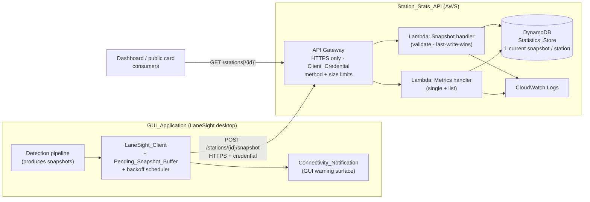
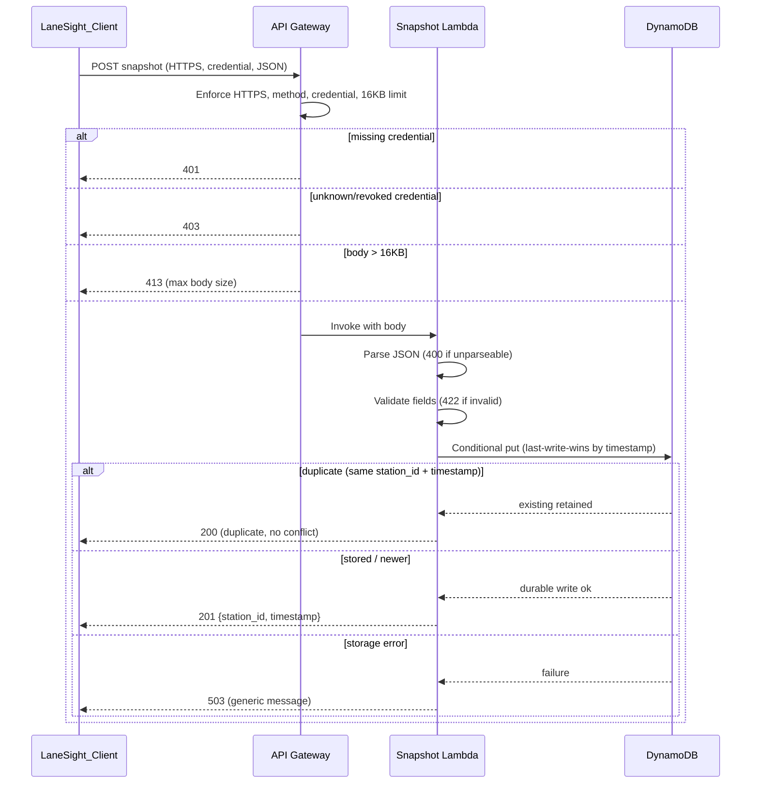
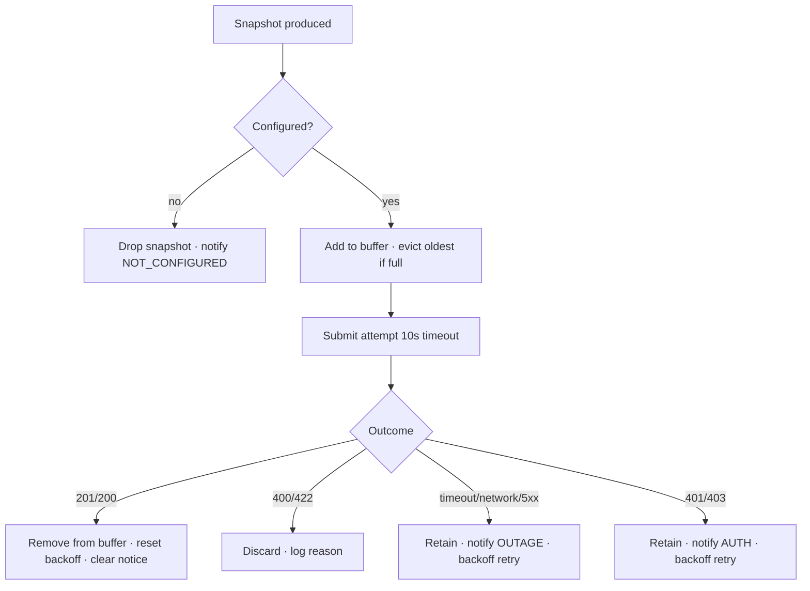

# Design Document

## Overview

The Station Statistics API is an AWS-hosted ingestion and retrieval service that collects Station Metric Snapshots from every Opus LaneSight instance in the field, stores the most recent snapshot per station, and serves those snapshots to internal and public consumers. It is composed of a cloud service (`Station_Stats_API`) and a client-side component (`LaneSight_Client`) that lives inside the existing `GUI_Application`.

The cloud service is built on three serverless AWS primitives:

- **API Gateway** terminates HTTPS, enforces the `Client_Credential`, rejects unencrypted requests, and routes the two resources (snapshot and metrics).
- **AWS Lambda** holds the request handlers that validate payloads, apply last-write-wins storage logic, and shape responses.
- **DynamoDB** is the `Statistics_Store`, holding exactly one current snapshot per `Station_Identifier`.

The client component captures snapshots produced by the detection pipeline, buffers them in a bounded in-memory `Pending_Snapshot_Buffer`, submits them over HTTPS with exponential backoff, and drives a `Connectivity_Notification` in the GUI so operators always know whether publishing is actually working.

This design is sized for the initial `Supported_Station_Count` of 50 stations and scales to at least twice that without schema or architecture changes, because each station occupies one independent DynamoDB partition and every request is processed independently.

### Design goals

1. **Durability before acknowledgement** — a `201` is only returned after the snapshot is durably written.
2. **Deterministic latest-per-station** — concurrent writers converge on the snapshot with the latest UTC-normalized timestamp.
3. **Honest client feedback** — the operator is never misled into believing data is published when it is not.
4. **Independent failure domains** — one station's failure, delay, or rejection never blocks another station.
5. **Privacy and secret hygiene** — credentials and driver-identifying data never appear in logs or responses.

### Scope

In scope: the ingestion endpoint, payload validation, authentication/authorization, latest-per-station storage with last-write-wins, single and list retrieval, scaling characteristics, client submission with buffering/backoff/eviction/duplicate handling, the GUI connectivity notification, and logging/observability.

Out of scope: dashboard/public-card visual styling, the computer-vision pipeline that produces snapshots, and Bedrock summary generation. The shape of the `Station_Metric_Snapshot` is a given input from the existing data model.

## Architecture

### High-level component diagram



### Endpoints

| Resource | Method | Path | Purpose |
|---|---|---|---|
| `Snapshot_Endpoint` | POST | `/stations/{station_id}/snapshot` | Ingest one snapshot for one station |
| `Metrics_Query_Endpoint` (single) | GET | `/stations/{station_id}` | Return current snapshot for a station |
| `Metrics_Query_Endpoint` (list) | GET | `/stations` | Return `{station_id, timestamp}` for every station with a snapshot |

API Gateway is configured so that any other method on these resources returns `405`, requests without a credential return `401`, and only HTTPS is accepted (no HTTP listener is exposed; the custom domain enforces TLS).

### Request lifecycle (POST)



### Why serverless and why DynamoDB

- **Independent processing (Req 6.4):** API Gateway + Lambda processes each request in its own invocation, so a slow or failing request for one station cannot block another.
- **Per-station isolation and scale (Req 4.4, 4.5, 6.1–6.3):** DynamoDB partitions by `station_id`. Each station is one partition key, so adding stations adds partitions, not schema changes. On-demand capacity absorbs bursts of 50–100+ stations writing once per 60s.
- **Convergence (Req 4.2, 4.6):** A single DynamoDB conditional write on the partition item gives a serialized, last-write-wins outcome without external locking.

## Components and Interfaces

### Station_Stats_API — Snapshot handler (Lambda)

Responsibilities:

1. Parse the request body as JSON; on failure return `400` with a malformed-JSON body.
2. Validate the parsed object against the `Station_Metric_Snapshot` rules (Requirement 2); on failure return `422` naming each failing field.
3. Strip fields beyond the Glossary-defined set before storage (Req 2.7).
4. Apply last-write-wins storage via a conditional `PutItem`.
5. Return `201` with `{station_id, timestamp}` on a durable write, `200` on a duplicate, `503` on a storage error.

Interface (internal handler contract):

```python
def handle_snapshot(raw_body: bytes, station_path_id: str) -> HttpResult:
    """Validate and store one snapshot. Returns an HttpResult carrying
    status code and JSON-serializable body. Never raises for client error;
    raises only for unexpected internal faults mapped to 503/500."""
```

Validation result type (drives the `422` field-naming response and is the unit under property test):

```python
@dataclass(frozen=True)
class ValidationResult:
    is_valid: bool
    cleaned: dict | None        # Glossary fields only, present iff is_valid
    failing_fields: list[str]   # field names that failed, empty iff is_valid
```

### Station_Stats_API — Metrics handler (Lambda)

Responsibilities:

1. Single read (`GET /stations/{id}`): validate `station_id` format (`400` if malformed), look up the item, return `200` with the snapshot or `404` if absent.
2. List read (`GET /stations`): scan/query the table projection of `{station_id, timestamp}` and return `200` with a list (empty list when no stations have snapshots).

Interface:

```python
def get_station(station_id: str) -> HttpResult       # 200 | 400 | 404
def list_stations() -> HttpResult                    # 200 (possibly empty list)
```

### Statistics_Store (DynamoDB adapter)

A thin adapter that encapsulates the last-write-wins conditional write and reads. It is the seam that property tests target with an in-memory fake so storage logic is verified without AWS calls.

```python
class StatisticsStore(Protocol):
    def put_if_newer(self, snapshot: dict) -> PutOutcome:
        """Store snapshot iff its UTC-normalized timestamp is strictly later
        than the currently stored snapshot for the same station_id, OR no
        snapshot exists. Same (station_id, timestamp) as stored => DUPLICATE.
        Earlier-or-equal-but-different => RETAINED_EXISTING.
        Returns STORED | DUPLICATE | RETAINED_EXISTING."""

    def get(self, station_id: str) -> dict | None
    def list_index(self) -> list[tuple[str, str]]   # (station_id, timestamp)
```

`PutOutcome` mapping to HTTP: `STORED → 201`, `DUPLICATE → 200`, `RETAINED_EXISTING → 201` (the request was valid and accepted; the older snapshot simply does not become current, per Req 4.3 — the client still treats it as published).

### LaneSight_Client (GUI component)

Responsibilities:

1. Receive snapshots from the pipeline and enqueue into `Pending_Snapshot_Buffer` (Req 7.1), stamping `station_id` with the active `Station_Identifier` (Req 7.2).
2. If `API_Base_URL` or `Client_Credential` is unconfigured, skip the attempt, drop the snapshot, and raise a "not configured" notification within 2s (Req 7.6).
3. Otherwise submit over HTTPS with a 10s timeout (Req 7.5, 7.7).
4. On `201`/duplicate `200`: remove from buffer (Req 7.3, 8.6). On `422`/`400`: discard and log the reason (Req 7.4). On timeout/network/`5xx`: retain and schedule retry with exponential backoff (Req 8.1–8.3).
5. On buffer overflow at 1000 entries: evict the single oldest by timestamp (Req 8.4) and notify of permanent drop (Req 9.7).
6. After recovery, drain the buffer oldest-first; stop the pass on the first failure and resume after the next backoff interval (Req 8.5, 8.7).

Interface:

```python
class LaneSightClient:
    def on_snapshot_produced(self, snapshot: Snapshot) -> None
    def _attempt_submit(self, snapshot: Snapshot) -> SubmitOutcome  # PUBLISHED|DISCARDED|RETRY|DUPLICATE
    def _next_backoff(self, consecutive_failures: int) -> float     # seconds
    def buffer_count(self) -> int
```

### Pending_Snapshot_Buffer

A bounded FIFO ordered by snapshot timestamp with a hard capacity of 1000.

```python
class PendingSnapshotBuffer:
    CAPACITY = 1000
    def add(self, snapshot: Snapshot) -> Snapshot | None
        """Insert maintaining ascending timestamp order. If at capacity,
        evict and return the single oldest (earliest timestamp) snapshot."""
    def peek_oldest(self) -> Snapshot | None
    def remove(self, snapshot: Snapshot) -> None
    def __len__(self) -> int
```

### Connectivity_Notification (GUI surface)

A presentation component bound to client state. It renders the warning visual treatment defined by the Opus UI guidelines: the orange attention color (`#FF8200`) paired with a visible text label (never color alone), per UI guideline §5/§14 and Req 9.4. It distinguishes three states:

- **Network/server failure** — "Statistics could not be published to the Station Stats API." Shows live `Pending_Snapshot_Buffer` count (Req 9.1, 9.2).
- **Auth failure (`401`/`403`)** — distinct copy indicating an authentication/authorization problem rather than an outage (Req 9.5).
- **Permanent drop** — indicates unpublished snapshots are being permanently dropped when the buffer evicts (Req 9.7).

On the first success after a failure it clears within 2s and indicates publishing resumed (Req 9.3). It never blocks other views (Req 9.6).

### Backoff scheduler

Computes the delay before the next attempt from the count of consecutive failures: `delay = min(2 * 2^(n-1), 60)` seconds for the n-th consecutive failure, i.e. 2, 4, 8, 16, 32, 60, 60, … (Req 8.2). Success resets the counter.

## Data Models

### Station_Metric_Snapshot (wire + stored shape)

```json
{
  "station_id": "demo_station_01",
  "timestamp": "2026-06-12T13:45:00-08:00",
  "vehicles_in_queue": 9,
  "vehicles_in_bay": 3,
  "active_lanes": 3,
  "average_queue_wait_minutes": 14.2,
  "average_inspection_minutes": 6.4,
  "estimated_public_wait_minutes": 18,
  "throughput_per_hour": 28,
  "slowest_lane_id": "lane_2",
  "confidence_score": 0.82
}
```

Field constraints (validation rules, Requirement 2):

| Field | Type | Constraint |
|---|---|---|
| `station_id` | string | 1–64 chars, `[a-z0-9_-]` only, non-empty |
| `timestamp` | string | ISO 8601 date-time with explicit UTC offset or `Z` |
| `vehicles_in_queue` | integer | 0 ≤ n ≤ 1,000,000 |
| `vehicles_in_bay` | integer | 0 ≤ n ≤ 1,000,000 |
| `active_lanes` | integer | 0 ≤ n ≤ 1,000,000 |
| `throughput_per_hour` | integer | 0 ≤ n ≤ 1,000,000 |
| `average_queue_wait_minutes` | number | 0 ≤ x ≤ 100,000 |
| `average_inspection_minutes` | number | 0 ≤ x ≤ 100,000 |
| `estimated_public_wait_minutes` | number | 0 ≤ x ≤ 100,000 |
| `confidence_score` | number | 0 ≤ x ≤ 1 |
| `slowest_lane_id` | string \| null | null, or 1–64 chars `[a-z0-9_-]` |

All fields except `slowest_lane_id` are required and non-null. Unknown extra fields are stripped before storage and do not cause rejection (Req 2.7).

### DynamoDB table: StationStatistics

| Attribute | Role |
|---|---|
| `station_id` (S) | Partition key — one item per station |
| `timestamp` (S) | Stored ISO 8601 timestamp of the current snapshot |
| `timestamp_utc` (S) | UTC-normalized ISO 8601 instant used for comparison |
| `snapshot` (M) | The full Glossary-field snapshot map as stored |

- **Key schema:** partition key `station_id` only (no sort key) — the table holds exactly the current snapshot per station, so single-item-per-station gives O(1) get and a naturally bounded item count.
- **Last-write-wins write:** `PutItem` with a condition expression `attribute_not_exists(station_id) OR :new_utc > timestamp_utc`. If the condition fails because timestamps are equal and the payload matches the duplicate definition, the handler treats it as a duplicate (`200`); if it fails because the incoming instant is older, the existing item is retained (Req 4.3).
- **Capacity:** on-demand billing mode, so concurrent writes across up to 100+ partitions need no provisioning change (Req 6.3).
- **List projection:** the list endpoint reads only `station_id` and `timestamp` (projection expression) to keep the list response small.

### Timestamp normalization

Comparison is always done on a UTC-normalized instant derived from the ISO 8601 value (offset or `Z` applied), so `2026-06-12T13:45:00-08:00` and `2026-06-12T21:45:00Z` compare as equal instants. The originally submitted `timestamp` string is preserved and returned as stored (Req 1.3, 1.4, 5.3); only `timestamp_utc` is used for ordering.

### Client-side models

```python
@dataclass(frozen=True)
class Snapshot:
    station_id: str
    timestamp: str           # ISO 8601 as produced
    payload: dict            # full snapshot fields

@dataclass
class ClientConfig:
    api_base_url: str | None
    client_credential: str | None   # never logged

class SubmitOutcome(Enum):
    PUBLISHED = auto()       # 201
    DUPLICATE = auto()       # 200
    DISCARDED = auto()       # 400/422
    RETRY = auto()           # timeout/network/5xx/401/403
```

## Correctness Properties

*A property is a characteristic or behavior that should hold true across all valid executions of a system — essentially, a formal statement about what the system should do. Properties serve as the bridge between human-readable specifications and machine-verifiable correctness guarantees.*

This feature is a strong fit for property-based testing: payload validation, last-write-wins convergence, idempotent duplicate handling, the bounded ordered buffer, and backoff are all pure logic with large input spaces and clear universal properties. Infrastructure concerns (HTTPS-only, method routing, credential enforcement at the gateway, latency, log delivery) are handled by integration and smoke tests instead — they are noted in the Testing Strategy.

The properties below were consolidated during prework reflection so each provides unique validation value.

### Property 1: Valid snapshots are accepted and stored

*For any* `Station_Metric_Snapshot` whose fields all satisfy the Requirement 2 validation rules, handling a POST of that snapshot returns HTTP `201` with a body containing the `station_id` and stored `timestamp`, and the snapshot becomes retrievable.

**Validates: Requirements 1.2, 1.4**

### Property 2: Storage and retrieval preserve every field

*For any* valid `Station_Metric_Snapshot`, after it is stored and then read back through the metrics path, the returned snapshot contains the same values for `station_id`, `timestamp`, `vehicles_in_queue`, `vehicles_in_bay`, `active_lanes`, `average_queue_wait_minutes`, `average_inspection_minutes`, `estimated_public_wait_minutes`, `throughput_per_hour`, `slowest_lane_id`, and `confidence_score` that were submitted (storage round-trip).

**Validates: Requirements 1.3, 4.1, 5.1, 5.3**

### Property 3: Validation accepts exactly the well-formed snapshots

*For any* candidate snapshot object, validation succeeds if and only if `station_id` is a 1–64 char `[a-z0-9_-]` string, `timestamp` is ISO 8601 with an explicit UTC offset or `Z`, the four integer fields are integers in `[0, 1000000]`, the three minute fields are numbers in `[0, 100000]`, `confidence_score` is a number in `[0, 1]`, and `slowest_lane_id` is null or a 1–64 char `[a-z0-9_-]` string.

**Validates: Requirements 2.1, 2.2, 2.3, 2.4, 2.8, 5.5**

### Property 4: Rejected snapshots name exactly the failing fields and store nothing

*For any* parsable snapshot that violates one or more validation rules (including missing or null required fields other than `slowest_lane_id`), the handler responds with HTTP `422`, the response body names exactly the set of fields that violate the rules, and no snapshot is stored.

**Validates: Requirements 2.6**

### Property 5: Extra fields are stripped and do not affect acceptance

*For any* valid snapshot extended with arbitrary additional keys not defined in the Glossary, the handler still responds with HTTP `201` and the stored snapshot contains exactly the Glossary-defined fields and none of the extra keys.

**Validates: Requirements 2.7**

### Property 6: The current snapshot is the latest instant, regardless of order

*For any* non-empty set of valid snapshots that share one `Station_Identifier`, after storing them in any order the current snapshot for that station is the one whose UTC-normalized timestamp is the latest among them; storing a snapshot with an earlier-or-equal instant never changes the current snapshot.

**Validates: Requirements 4.2, 4.3, 4.6**

### Property 7: Stations are retained independently

*For any* collection of valid snapshots spanning distinct `Station_Identifiers` (including counts at and above the Supported_Station_Count of 50), storing a snapshot for one station never alters the current snapshot of any other station, and every station with a stored snapshot remains independently retrievable.

**Validates: Requirements 4.4, 4.5, 6.4**

### Property 8: The list endpoint reflects exactly the stored stations

*For any* set of stored current snapshots, a GET without a `Station_Identifier` returns HTTP `200` and a list whose entries are exactly the `Station_Identifier` and current `timestamp` of every station that has a stored snapshot, and the list is empty when no station has a snapshot.

**Validates: Requirements 5.4, 5.6**

### Property 9: Unknown well-formed stations return 404

*For any* well-formed `Station_Identifier` that has no stored snapshot, a GET for that station returns HTTP `404`.

**Validates: Requirements 5.2**

### Property 10: Resubmitting a stored snapshot is idempotent

*For any* snapshot already stored, resubmitting a snapshot with the same `Station_Identifier` and `timestamp` returns HTTP `200` and leaves the `Statistics_Store` unchanged (no conflicting or duplicate record is created).

**Validates: Requirements 8.8**

### Property 11: Buffer outcome handling is correct per response

*For any* snapshot in the `Pending_Snapshot_Buffer`, a successful or duplicate outcome (`201`/`200`) removes exactly that snapshot from the buffer; a terminal-reject outcome (`400`/`422`) removes that snapshot and records a rejection reason; and a retryable outcome (timeout, network error, or `5xx`) retains that snapshot in the buffer and schedules a retry.

**Validates: Requirements 7.3, 7.4, 8.1, 8.6**

### Property 12: The pending buffer is bounded and evicts the oldest

*For any* sequence of snapshot additions, the `Pending_Snapshot_Buffer` length never exceeds 1000, and whenever an addition occurs at capacity the snapshot removed is exactly the single one with the earliest timestamp.

**Validates: Requirements 8.4**

### Property 13: Draining publishes in ascending timestamp order and preserves order on failure

*For any* set of buffered snapshots, a publishing pass attempts them in non-decreasing timestamp order (oldest first); and if an attempt fails partway through, the remaining snapshots stay in the buffer in ascending timestamp order for the next pass.

**Validates: Requirements 8.5, 8.7**

### Property 14: Exponential backoff doubles from 2s and caps at 60s

*For any* count of consecutive failures `n ≥ 1`, the scheduled backoff delay equals `min(2 · 2^(n-1), 60)` seconds; the sequence is non-decreasing in `n` and never exceeds 60 seconds.

**Validates: Requirements 8.2**

### Property 15: Unconfigured client skips submission and reports not-configured

*For any* produced snapshot, when either `API_Base_URL` or `Client_Credential` is unconfigured, the `LaneSight_Client` makes no `Submission_Attempt`, removes that snapshot from the `Pending_Snapshot_Buffer`, and the derived `Connectivity_Notification` state indicates that publishing is not configured.

**Validates: Requirements 7.6**

### Property 16: Submitted snapshots carry the active station identifier

*For any* produced snapshot, when the client is configured the submitted snapshot's `station_id` equals the active `Station_Identifier` of the `GUI_Application` at production time, and a submission attempt is made to the configured `Snapshot_Endpoint`.

**Validates: Requirements 7.1, 7.2, 7.7**

### Property 17: Notification state derives from the latest outcome and buffer

*For any* sequence of submission outcomes, the derived `Connectivity_Notification` state is: visible with an authentication/authorization category when the latest failure status is `401` or `403`; visible with an outage category for timeout, network, or `5xx` failures; a permanent-drop indication when an eviction has just occurred; and cleared (publishing resumed) after a success; and while visible it displays the current `Pending_Snapshot_Buffer` count.

**Validates: Requirements 9.1, 9.2, 9.5, 9.7**

### Property 18: Logs and responses never leak credentials or driver data

*For any* request and any `Client_Credential` value, the generated log entry and the response body contain no occurrence of the credential value and no license-plate text or driver-identifying data.

**Validates: Requirements 3.5, 10.3**

### Property 19: Every handled request produces one complete log entry

*For any* accepted or rejected `Snapshot_Endpoint` request, the handler emits exactly one log entry recording the `Station_Identifier` (or an explicit indicator when absent or unparseable), the resulting HTTP status code, the request timestamp as an ISO 8601 value, and — for a rejected request — a category describing the rejection reason.

**Validates: Requirements 10.1**

### Property 20: 5xx responses are generic

*For any* request that results in a `5xx` response, the response body contains a generic "could not be completed" message and contains no internal stack traces, internal error codes, or implementation details.

**Validates: Requirements 10.4**

## Error Handling

### Server-side error mapping

The Snapshot and Metrics handlers map every failure to a deterministic HTTP status and a safe body. Client errors never raise; only unexpected internal faults surface as `5xx`.

| Condition | Status | Body | Side effects |
|---|---|---|---|
| Missing credential | `401` | generic auth-required | none stored/returned (Req 3.2) |
| Unknown/revoked credential | `403` | generic forbidden | none stored/returned (Req 3.3) |
| Unencrypted HTTP | rejected pre-handler | — | body not processed (Req 3.6) |
| Wrong method on resource | `405` | method-not-allowed | none (Req 1.5, 5.7) |
| Body > 16KB | `413` | "request exceeds maximum allowed body size" | nothing stored (Req 1.6) |
| Unparseable JSON | `400` | "malformed JSON" | nothing stored (Req 2.5) |
| Malformed `station_id` on GET | `400` | "malformed station identifier" | none (Req 5.5) |
| Validation failure | `422` | names each failing field | nothing stored (Req 2.6) |
| No snapshot for station | `404` | "no statistics for station" | none (Req 5.2) |
| Storage failure | `503` | generic error | no partial record (Req 10.2) |
| Unexpected internal fault | `500` | generic error | — |

- **Generic 5xx bodies (Req 10.4):** `5xx` responses use a fixed message and never include stack traces, internal codes, or implementation details. Internal detail is written to CloudWatch only.
- **No partial writes (Req 10.2):** the conditional `PutItem` is atomic — either the new item is the current snapshot or it is not. A DynamoDB error returns `503` and leaves the prior current snapshot intact.
- **Logging never fails the request (Req 10.5):** the handler wraps the log emit in a guarded call; if logging raises, the request still returns the status it would otherwise return.
- **Duplicate vs. stale:** equal `(station_id, timestamp)` to the stored item → `200` duplicate (Req 8.8). Older instant, different payload → the write is accepted as valid but does not become current (Req 4.3); the client still treats the request as published.

### Client-side error handling



- Retryable failures (`timeout`, network error, `5xx`) and auth failures (`401`/`403`) both retain the snapshot and back off, but produce different notification categories (Req 9.1, 9.5).
- Terminal rejects (`400`/`422`) are logged with the rejection reason and discarded — retrying them would never succeed (Req 7.4).
- Eviction on overflow emits a permanent-drop notification so the operator knows data was lost (Req 9.7).

## Testing Strategy

A dual approach is used. Property-based tests verify the universal logic; unit, integration, and smoke tests cover concrete examples, infrastructure wiring, UI presentation, and performance.

### Property-based tests

- **Library:** Hypothesis (Python) — the workspace already uses Hypothesis (see `.hypothesis/`). Do not implement property testing from scratch.
- **Iterations:** each property test runs a minimum of 100 examples (`@settings(max_examples=100)` or higher).
- **Targets:** the pure logic seams — the validator (`ValidationResult`), the `StatisticsStore` adapter against an in-memory fake, the `PendingSnapshotBuffer`, the backoff function, the client outcome handler, the notification state reducer, and the log-entry builder. AWS calls are replaced with in-memory fakes so 100+ iterations stay cheap.
- **Generators:** snapshot generators produce valid snapshots, near-boundary values (0, 1, 1,000,000, 100,000, 1.0), invalid field combinations with a known failing-field set, mixed UTC offsets and `Z` timestamps (including distinct strings denoting the same instant), unicode/extra keys, and credential/plate-like strings to assert log hygiene.
- **Tagging:** each property test is tagged with a comment referencing its design property in the form:
  `# Feature: station-stats-api, Property {number}: {property_text}`
- **Coverage:** Properties 1–20 above each map to a single property-based test.

### Unit and example tests

- Empty-store list returns `[]` (Req 5.6 base case).
- Malformed-JSON `400` and oversize `413` boundary examples (Req 2.5, 1.6).
- Backoff sequence concrete values: 2, 4, 8, 16, 32, 60, 60 (Req 8.2).
- Client 10s timeout is configured (Req 7.5); no fixed max-attempt cap exists (Req 8.3).

### Integration tests (1–3 examples each — NOT property tests)

These verify infrastructure and external behavior that does not vary meaningfully with input:

- Credential required, missing → `401`, bad → `403` on both endpoints (Req 3.1, 3.2, 3.3).
- Non-POST on snapshot resource → `405`; non-GET on metrics resource → `405` (Req 1.5, 5.7).
- HTTPS-only: unencrypted request is rejected before the handler (Req 3.4, 3.6).
- Storage-error injection → `503` with no partial record (Req 10.2).
- End-to-end independence: a failing request for one station does not block another (Req 6.4).
- Load tests: 50 stations within 60s succeed (Req 6.1); p95 ≤ 2000ms under concurrent load (Req 6.2); 100 stations still return `201` with no schema change (Req 6.3).

### Smoke tests (single execution)

- POST routing accepts a `≤16KB` body (Req 1.1).
- TLS policy / custom domain configured for HTTPS only (Req 3.4).

### UI tests (GUI_Application)

Verified with browser/DOM assertions per the steering testing policy:

- Notification appears within 2s on failure and clears within 2s on recovery (Req 9.1, 9.3).
- Buffer count updates within 2s of a change (Req 9.2).
- Auth-failure copy is distinct from outage copy (Req 9.5).
- Permanent-drop indication on eviction (Req 9.7).
- Warning treatment uses the Opus orange token (`#FF8200`) paired with a visible text label, never color alone (Req 9.4; UI guidelines §5, §14).
- Other views remain interactive while the notification is shown (Req 9.6).

## Design-to-Requirements Mapping

| Requirement | Acceptance criteria | Design coverage |
|---|---|---|
| 1 Ingest snapshot | 1.1–1.6 | Snapshot handler, API Gateway size/method limits, durable-write-then-201; Properties 1, 2; edge tests 1.6 |
| 2 Validate snapshot | 2.1–2.8 | `ValidationResult`, field-strip; Properties 3, 4, 5; edge test 2.5 |
| 3 Auth & HTTPS | 3.1–3.6 | API Gateway authorizer, TLS-only domain, secret redaction; Property 18; integration/smoke 3.1–3.6 |
| 4 Latest per station | 4.1–4.6 | DynamoDB conditional `put_if_newer`, per-station partition; Properties 2, 6, 7 |
| 5 Retrieve | 5.1–5.7 | Metrics handler single + list; Properties 2, 8, 9, 3; example 5.6; integration 5.7 |
| 6 Scale | 6.1–6.4 | Serverless + on-demand DynamoDB, independent invocations; Property 7; load tests 6.1–6.3 |
| 7 Client submit | 7.1–7.7 | LaneSight_Client, buffer enqueue, station_id stamping; Properties 11, 15, 16; example 7.5 |
| 8 Retry & buffer | 8.1–8.8 | Backoff scheduler, bounded buffer, drain ordering, idempotent store; Properties 10, 11, 12, 13, 14; example 8.3 |
| 9 Connectivity notification | 9.1–9.7 | Connectivity_Notification state reducer + GUI surface; Property 17; UI tests |
| 10 Logging & observability | 10.1–10.5 | Guarded log builder, generic 5xx, no-partial-write; Properties 18, 19, 20; edge tests 10.2, 10.5 |
